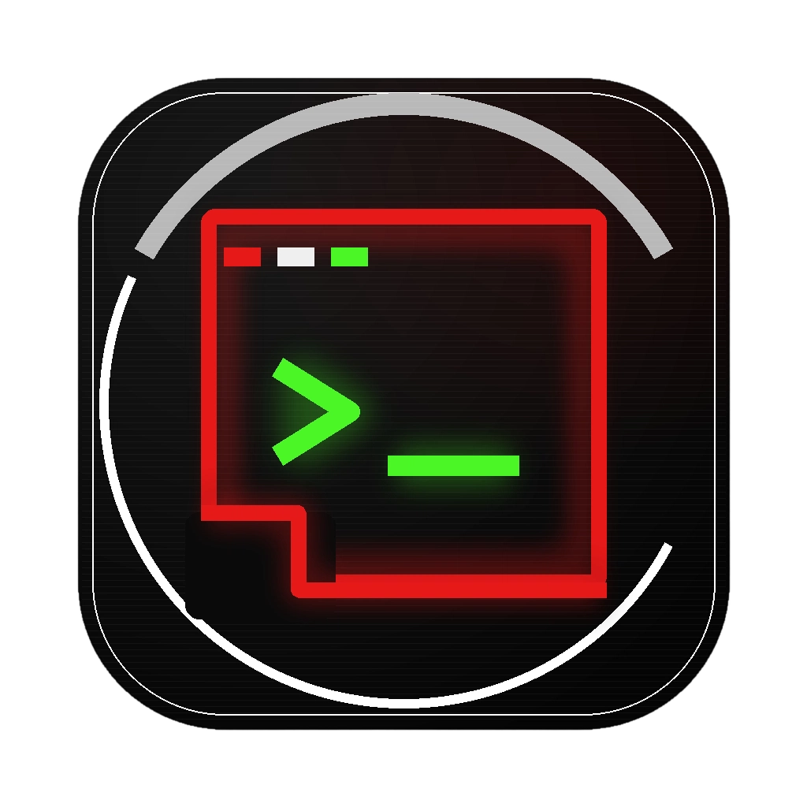

<p align="center">
  
</p>

<h1 align="center">JDC Code</h1>

<p align="center">
  <strong>你的 AI 编程搭档 — 用对话写代码</strong>
</p>

<p align="center">
  <a href="https://github.com/u53/jdc_agent/releases"></a>
  
  
  
  
</p>

<p align="center">
  <a href="./README.md">English</a> · <a href="./README.zh-CN.md">简体中文</a>
</p>

---

## JDC Code 是什么

JDC Code 是一个桌面端 AI 编程助手，连接你的模型，通过 **30+ 内置工具**让 AI 完整操控你的代码库。它支持 Claude、GPT、Gemini、Ollama 以及任何 OpenAI 兼容接口 — 原生支持三种协议（`Anthropic Messages`、`OpenAI Chat Completions`、`OpenAI Responses`）。

想象一个坐在你旁边的 AI 同事：它能读代码、搜索项目、执行命令、编辑文件，甚至能**组建虚拟 AI 团队**并行处理复杂任务 — 一切都在你可控的权限体系下进行。

---

## 快速上手

### 第一步：安装

从 [GitHub Releases](https://github.com/u53/jdc_agent/releases) 下载最新版本。

**macOS** — 应用未代码签名。如果 macOS 阻止打开：

```bash
xattr -cr "/Applications/JDC Code.app"
```

**Windows** — SmartScreen 警告点击「更多信息」→「仍要运行」。

### 第二步：打开项目

启动应用，你会看到**项目页面** — 点击 **「打开文件夹」**（或按 `⌘N` / `Ctrl+N`）选择你的项目目录。这会创建第一个会话，显示在左侧栏中。

### 第三步：配置模型

JDC Code 不自带模型 — 你需要自己的 API Key。打开**设置**（`⌘,` / `Ctrl+,`），进入**「模型」**选项卡。

一个**模型分组**将提供商连接（协议 + Base URL + API Key）与一个或多个模型打包在一起。你可以创建多个分组，混用不同提供商。

#### 示例：Anthropic (Claude)

点击 **「+ 新建分组」**，填写：

| 字段 | 值 |
|-------|-------|
| 分组名称 | `Anthropic` |
| 协议 | `Anthropic (/v1/messages)` |
| Base URL | *（留空 — 默认 `https://api.anthropic.com`）* |
| API Key | `sk-ant-...` |

点击**「确认」**，展开分组后添加模型：

| 字段 | 值 |
|-------|-------|
| 显示名称 | `Claude Opus 4` |
| Model ID | `claude-opus-4-20250514` |
| 上下文窗口 | `200000` |
| 最大 Token | `32000` |
| 压缩比例 | `90` |

点击**测试按钮**（▶）验证连接。

#### 示例：OpenAI (GPT-5, o4-mini)

| 字段 | 值 |
|-------|-------|
| 分组名称 | `OpenAI` |
| 协议 | `OpenAI (/v1/chat/completions)` |
| Base URL | *（留空 — 默认 `https://api.openai.com/v1`）* |
| API Key | `sk-...` |

添加模型：Model ID `gpt-5`，上下文窗口 `200000`。

> **提示**：推理模型（如 `o3`、`o4-mini`、`claude-opus-4`）会被自动检测。当你在编辑器工具栏的**推理强度**下拉框中选择时，应用会自动发送 `thinking` 参数并移除 `temperature`。

#### 示例：Ollama（本地模型）

| 字段 | 值 |
|-------|-------|
| 分组名称 | `Ollama` |
| 协议 | `OpenAI (/v1/chat/completions)` |
| Base URL | `http://localhost:11434/v1` |
| API Key | `ollama`（任意非空值） |

添加模型：Model ID `llama4`，上下文窗口 `131072`。

#### 示例：OpenRouter

| 字段 | 值 |
|-------|-------|
| 分组名称 | `OpenRouter` |
| 协议 | `OpenAI (/v1/chat/completions)` |
| Base URL | `https://openrouter.ai/api/v1` |
| API Key | `sk-or-...` |

添加模型：Model ID `anthropic/claude-opus-4`，上下文窗口 `200000`。

#### 示例：Google Gemini

| 字段 | 值 |
|-------|-------|
| 分组名称 | `Gemini` |
| 协议 | `OpenAI (/v1/chat/completions)` |
| Base URL | `https://generativelanguage.googleapis.com/v1beta/openai` |
| API Key | 你的 Gemini API Key |

#### 选择当前模型

添加模型后，在编辑器工具栏（聊天区域底部）的下拉框中选择当前使用的模型。你可以在会话中途切换模型 — 上下文不会丢失。

### 第四步：开始对话

在底部的编辑器中输入消息，按回车发送。AI 会看到你的项目结构、git 状态和打开的文件，然后直接操作：读文件、搜代码、执行命令、编辑代码。

---

## 核心功能

### 👥 Team 模式

一键召唤虚拟 AI 软件团队。**项目经理 AI** 拆解目标、调度多个**专业 Worker 代理**并行执行、盯进度、失败时主动介入、定期汇报。

直接告诉 AI，比如：

> "建个团队帮我做用户认证系统 — 一个人负责数据库设计，一个人负责 API 路由，一个人负责前端组件。"

每个 Worker 可以用不同模型 — 把强模型留给规划，把快模型派去执行。整个过程你可以随时和 PM 对话，改方向、催进度、提前收尾。

### 🚀 子代理

派发专业化代理处理独立任务。可用类型：

| 代理类型 | 用途 |
|-----------|------|
| **Explore** | 快速只读搜索定位代码 |
| **Plan** | 分析代码并撰写实施方案 |
| **Refactor** | 重构代码结构不改行为 |
| **Security Auditor** | 分析安全漏洞 |
| **Frontend Designer** | 将设计稿转为组件架构 |
| **General** | 全工具权限，处理复杂多步任务 |

子代理在后台运行，完成时通知你。最多 3 个并发。

### 📜 Skills 技能系统

Skills 是可复用的提示词模板，自动变成斜杠命令。在 `.jdcagnet/skills/` 下放一个 markdown 文件即可自动发现。

**示例** — 创建 `.jdcagnet/skills/code-review.md`：

```markdown
---
name: code-review
description: 检查代码的 bug、风格问题和改进点
arguments:
  - file-path
argument-hint: "<文件路径>"
allowed-tools:
  - Bash
  - file_read
  - grep
---

审查文件 ${1}，检查：
1. Bug 和逻辑错误
2. 风格和命名问题
3. 性能问题
4. 安全漏洞

将发现写入简洁的报告。
```

然后在编辑器中输入 `/code-review src/auth.ts`。

**Frontmatter 字段：**

| 字段 | 必填 | 说明 |
|-------|------|------|
| `name` | 是 | 技能名（即斜杠命令） |
| `description` | 否 | 在技能选择器中展示 |
| `arguments` | 否 | 位置参数名 |
| `argument-hint` | 否 | 编辑器中显示的占位符 |
| `allowed-tools` | 否 | 限制技能可用的工具 |
| `user-invocable` | 否 | 设为 `false` 则不显示在斜杠菜单（默认 `true`） |

Skills 可放在 `~/.jdcagnet/skills/`（全局）或 `<项目>/.jdcagnet/skills/`（项目级）。项目级覆盖同名的全局技能。

### 🎯 规划模式

AI 进入受限只读模式分析代码并撰写实施方案，你审阅通过后才执行修改。

按 `Shift+Tab` 或点击编辑器工具栏的规划开关。方案以 markdown 形式保存在 `.jdcagnet/plans/`。

### 🔌 MCP 服务器

通过 [Model Context Protocol](https://modelcontextprotocol.io) 接入外部工具。在 `.jdcagnet/mcp-servers.json`（项目）或 `~/.jdcagnet/mcp-servers.json`（全局）中配置。

**Stdio 示例** — 文件系统访问：

```json
{
  "filesystem": {
    "transport": "stdio",
    "command": "npx",
    "args": ["-y", "@modelcontextprotocol/server-filesystem", "/允许访问的目录路径"]
  }
}
```

**SSE 示例** — 远程服务器：

```json
{
  "my-server": {
    "transport": "sse",
    "url": "http://localhost:3000/sse"
  }
}
```

在**设置 → MCP** 中管理：查看连接状态、列出工具、启用/禁用、重连。

### 🪝 Hooks 钩子系统

在工具调用前后执行 shell 命令，实施策略检查或触发副作用。在 `.jdcagnet/hooks.json` 中配置。

**示例** — 拦截危险 git 命令：

```json
{
  "hooks": {
    "PreToolUse": [
      {
        "matcher": "Bash",
        "hooks": [{
          "type": "command",
          "command": "node -e \"const i=JSON.parse(require('fs').readFileSync('/dev/stdin','utf8')); if(i.tool_input?.command?.includes('rm -rf /')) process.exit(1)\"",
          "timeout": 5000
        }]
      }
    ]
  }
}
```

Hooks 通过 stdin 接收 JSON 输入，可返回 `{"decision": "block", "reason": "..."}` 阻止执行。

支持的事件：`PreToolUse`、`PostToolUse`。匹配模式：`"*"`（所有工具）、`"ToolName"`（精确匹配）、`"prefix*"`（前缀匹配）。

### 💾 跨会话持久记忆

AI 记住你的偏好、项目背景和历史决策。压缩上下文时自动提取记忆，以 markdown 文件存储在 `~/.jdcagnet/projects/<项目路径>/memory/`。

**记忆类型：**
- **User**（用户）— 你的角色、偏好、专业领域
- **Project**（项目）— 进行中的工作、截止日期、决策
- **Feedback**（反馈）— 纠偏记录、验证过的方法
- **Reference**（参考）— 外部系统指针（Linear、Grafana 等）

可直接查看和编辑记忆文件。`MEMORY.md` 索引文件列出所有条目。

### 📝 自定义指令

**`JDCAGNET.md`** — 放在项目根目录提供项目级指引，或放在 `~/.jdcagnet/JDCAGNET.md` 作为全局指令。内容注入系统提示词。

**`.jdcagnet/rules/*.md`** — 模块化规则文件，与 `JDCAGNET.md` 一同加载。用于分离关注点（如 `testing.md`、`style.md`、`deployment.md`）。

示例 `JDCAGNET.md`：

```markdown
# 项目背景
- 这是一个 Next.js 14 应用，使用 App Router
- 默认使用服务端组件，仅在必要时添加 'use client'
- 所有 API 路由使用 Zod 做参数校验

# 构建命令
- `pnpm dev` — 启动开发服务器
- `pnpm build` — 生产构建
- `pnpm test` — 运行 vitest 测试
```

### 🔐 权限系统

三种模式控制 AI 的自主任意程度：

| 模式 | 读 | 写 | 执行 | 危险操作 |
|------|------|-------|---------|-----------|
| **宽松** | 自动 | 自动 | 自动 | 询问 |
| **标准** | 自动 | 询问 | 询问 | 询问 |
| **严格** | 自动 | 询问 | 询问 | 询问（所有写操作） |

从编辑器工具栏切换。标准模式为默认。

### 🖥️ IDE 集成

自动检测 VS Code、JetBrains IDE 和 Xcode。连接后 AI 可打开文件并定位到指定行列、展示 diff 视图、拉取 LSP 诊断信息。当前文件和选区可作为 AI 上下文。

> **JetBrains 用户**：需安装 `packages/jetbrains-plugin/` 中的配套插件。IDE 连接状态显示在编辑器工具栏。

### ⚡ 内置终端

按 `` ⌘` `` / `` Ctrl+` `` 切换终端面板。使用真实 PTY（xterm.js + node-pty），因此 `npm init`、`git rebase` 等交互式命令正常工作。AI 也可通过 Bash 工具直接执行非交互式命令。

---

## 配置文件参考

所有配置文件位于项目下的 `.jdcagnet/`（项目范围）或 `~/.jdcagnet/`（全局范围）。项目配置覆盖全局配置。

```
.jdcagnet/
├── JDCAGNET.md          # 项目指令（注入系统提示词）
├── hooks.json           # Pre/Post 工具使用钩子
├── mcp-servers.json     # MCP 服务器定义
├── skills/              # 斜杠命令技能定义
│   └── code-review.md
├── rules/               # 模块化指令文件
│   ├── testing.md
│   └── conventions.md
└── plans/               # 规划模式输出（自动生成）
```

---

## 快捷键

| 快捷键 | 操作 |
|----------|--------|
| `⌘N` / `Ctrl+N` | 新建会话（打开文件夹） |
| `⌘W` / `Ctrl+W` | 关闭当前会话 |
| `⌘K` / `Ctrl+K` | 清空对话 |
| `⌘,` / `Ctrl+,` | 打开设置 |
| `Escape` | 停止生成 |
| `Shift+Tab` | 切换规划模式 |
| `` ⌘` `` / `` Ctrl+` `` | 切换终端 |
| `⌘1`–`9` | 切换到第 1–9 个会话 |

---

## 开发

```bash
pnpm install       # 安装依赖
pnpm dev           # 开发模式（Vite + Electron）
pnpm build         # 构建所有包
pnpm package       # 打包分发
pnpm test          # 运行核心测试
```

最低要求：Node.js 20+、pnpm 9+。

---

## 架构

```
packages/
├── core/            # 会话引擎、30+ 工具、模型提供者、MCP、IDE、Hooks、Skills
├── electron/        # 主进程、IPC 处理、终端服务、Git 服务
├── ui/              # React 19 + Zustand 5 + Tailwind CSS 4（Vite）
├── jetbrains-plugin/ # JetBrains IDE 配套插件
└── vscode-extension/ # VS Code 配套扩展
```

**技术栈：** `Electron 33` · `React 19` · `Zustand 5` · `Tailwind CSS 4` · `esbuild` · `node-pty` · `xterm.js` · `sql.js`

---

## 许可证

本项目仅供学习和个人使用，禁止商业用途。详见 [LICENSE](./LICENSE)。

---

<p align="center">
  <sub>为思考即代码的开发者打造 ❤️</sub>
</p>
