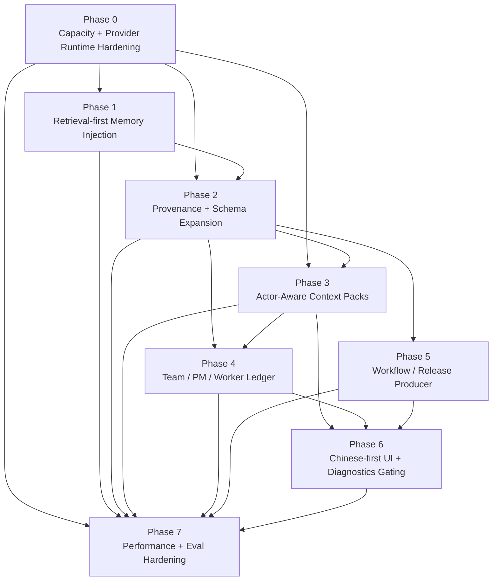

# JDC Context Engine V2 Master Roadmap Implementation Plan

> **For agentic workers:** REQUIRED SUB-SKILL: Use superpowers:subagent-driven-development (recommended) or superpowers:executing-plans to implement this plan task-by-task. Steps use checkbox (`- [ ]`) syntax for tracking.

**Goal:** Upgrade JDC Context Engine into a project-level context operating system that supports uncapped relevance-first context capacity, real provider signals, retrieval-first memory, provenance, actor-aware context packs, Team/PM/Worker ledger ingestion, workflow understanding, Chinese-first UI, and performance/eval hardening.

**Architecture:** Implement V2 as incremental phases on top of the current context package. Each phase produces working software with tests, keeps existing JDC code tools compatible, and preserves project-local persistence under `.jdcagnet/context-engine/`.

**Tech Stack:** TypeScript, Vitest, sql.js context store, Electron IPC, React UI, existing JDC Context Engine providers, Team runtime, and JDC code intelligence tools.

---

## How To Use This Roadmap

This is the master roadmap for the whole V2 effort. It is intentionally broader than the Phase 1 execution plan.

Execution rule:

- Use this roadmap for PM/team assignment, sequencing, ownership, and acceptance criteria.
- Use a per-phase execution plan for exact TDD steps before coding that phase.
- Phase 0 has a detailed execution plan at `docs/superpowers/plans/2026-06-03-jdc-context-engine-v2-phase0-capacity-runtime-plan.md`.
- Phase 1 has a detailed execution plan at `docs/superpowers/plans/2026-06-03-jdc-context-engine-v2-phase1-retrieval-plan.md`.
- Before starting Phase 2, generate `2026-06-03-jdc-context-engine-v2-phase2-provenance-plan.md` using the interfaces produced by Phase 1.

Do not let teams work on later phases against guessed interfaces. Later phases may start design prep and tests, but implementation must respect the dependency graph below.

## Dependency Graph



## Global Non-Negotiables

- Do not rename `JDC Context Engine`.
- Do not move persistence out of the active project `.jdcagnet/context-engine/`.
- Do not make accepted project facts session-isolated.
- Do not leak facts across different project roots.
- Do not store raw hidden reasoning.
- Do not keep the old 2.5k/700/900 artificial context caps in production defaults.
- Do not impose a new arbitrary 8k/32k cap inside the engine; selection is relevance-first and provider fallback is protocol-safe.
- Do not inject all memories.
- Do not block foreground chat on model harvest, full indexing, or heavy retrieval.
- Do not starve providers with 120ms/200ms defaults that make real project context empty.
- Do not leave memory provider as an empty shell.
- Do not reduce `JDCAGNET.md`, `AGENTS.md`, or `README.md` to the first three lines.
- Do not prepend a conflicting Claude persona ahead of JDCAGNET in normal provider prompts.
- Do not change Anthropic adaptive thinking behavior in Phase 0.
- Do not expose failed/no-op/rejected diagnostics as primary user memory.
- Do not make normal users manually refresh or reindex context.
- Do not break existing `Jdc*` code intelligence tools.
- Do not hide Team/PM/Worker outputs from project context after they produce durable value.

## Global Verification Commands

Run these after each phase unless the phase-specific plan says otherwise:

```bash
pnpm --filter @jdcagnet/core exec vitest run src/context/context-config.test.ts src/context/context-retriever.test.ts src/context/context-orchestrator.test.ts src/context/signal-providers.test.ts src/providers/provider-prompt-contract.test.ts src/context/context-product-evals.test.ts src/tools/memory-tools.test.ts src/session-context.test.ts --no-file-parallelism
```

```bash
pnpm --filter @jdcagnet/core build
```

```bash
git diff --check
```

For UI phases also run:

```bash
pnpm --filter @jdcagnet/ui exec vitest run src/components/context/context-panels.test.tsx src/stores/context-store.test.tsx src/lib/context-inspector-visibility.test.ts --no-file-parallelism
```

```bash
pnpm --filter @jdcagnet/ui build
```

## Phase 0: Capacity And Provider Runtime Hardening

**Status:** Detailed execution plan created.

**Detailed Plan:** `docs/superpowers/plans/2026-06-03-jdc-context-engine-v2-phase0-capacity-runtime-plan.md`

### Goal

Make the existing engine actually deliver useful project context before deeper retrieval/Team/UI work begins. This phase removes artificial context ceilings, fixes empty/thin providers, raises provider runtime budgets, and hardens provider prompt construction. It does not change Anthropic adaptive thinking behavior.

### P0 Diagnosis Table

| Priority | Problem | Current File | Required Outcome |
| --- | --- | --- | --- |
| P0 | Engine caps context at `2500/700/900`, so collected data is dropped before the model sees it. | `packages/core/src/context/config.ts`, `packages/core/src/context/budgeter.ts`, `packages/core/src/context/orchestrator.ts` | Remove artificial production caps. Context selection is relevance-first; provider overflow uses safe degradation/retry diagnostics. |
| P0 | Provider timeout defaults `120ms/200ms` make real code/git/project providers degrade to empty context. | `packages/core/src/context/config.ts`, `packages/core/src/context/orchestrator.ts`, `packages/core/src/session.ts`, `packages/core/src/sub-session.ts` | Raise foreground soft provider timeout to a realistic baseline and keep heavy jobs out of foreground. |
| P0 | Memory provider is an empty shell, so accepted project memories do not enter context through the provider layer. | `packages/core/src/context/providers/memory-provider.ts` | Emit accepted project memory sections with citations; Phase 1 replaces direct selection with retriever ranking. |
| P0 | Project provider only reads first three non-empty lines for important markdown project docs. | `packages/core/src/context/providers/project-provider.ts` | Extract useful headings, conventions, workflows, scripts, and README/AGENTS/JDCAGNET content beyond the first three lines. |
| P0 | Anthropic stream prompt prepends a Claude persona, creating identity conflict and wasting prompt space. | `packages/core/src/providers/anthropic.ts` | Keep JDC identity first and preserve official Anthropic Messages API block shape. |
| P0 | Stream/non-stream/provider prompt semantics are not tested for JDC Context Engine parity. | `packages/core/src/providers/anthropic.ts`, `packages/core/src/providers/openai-chat.ts`, `packages/core/src/providers/openai-responses.ts` | Add provider prompt contract tests for Anthropic, OpenAI Chat, and OpenAI Responses. |
| P1 | Git provider has useful hot-file signals but lacks direct branch/status/log style context. | `packages/core/src/context/providers/git-provider.ts` | Add direct git state signals while keeping hot-file summaries. |

### Files

- Modify: `packages/core/src/context/types.ts`
- Modify: `packages/core/src/context/schemas.ts`
- Modify: `packages/core/src/context/config.ts`
- Modify: `packages/core/src/context/budgeter.ts`
- Modify: `packages/core/src/context/orchestrator.ts`
- Modify: `packages/core/src/session.ts`
- Modify: `packages/core/src/sub-session.ts`
- Modify: `packages/core/src/context/providers/memory-provider.ts`
- Modify: `packages/core/src/context/providers/project-provider.ts`
- Modify: `packages/core/src/context/providers/git-provider.ts`
- Modify: `packages/core/src/providers/anthropic.ts`
- Modify: `packages/core/src/providers/openai-chat.ts`
- Modify: `packages/core/src/providers/openai-responses.ts`
- Create: `packages/core/src/context/context-config.test.ts`
- Create: `packages/core/src/providers/provider-prompt-contract.test.ts`
- Modify: `packages/core/src/context/signal-providers.test.ts`
- Modify: `packages/core/src/context/context-orchestrator.test.ts`
- Modify: `packages/core/src/session-context.test.ts`
- Modify: `packages/core/src/context/context-product-evals.test.ts`

### Required Deliverables

- Default config no longer sets `maxBundleTokens: 2500`, `maxSectionTokens: 700`, or `maxCodeTokens: 900`.
- No new arbitrary context cap such as 8k or 32k is introduced inside the engine.
- Explicit debug/user caps still work when configured.
- Provider timeout defaults are realistic for cached/indexed project signals.
- Memory provider emits accepted project facts with citations.
- Project provider preserves useful markdown and config content.
- Git provider includes branch/status/recent commits plus existing hot-file value.
- Anthropic prompt construction keeps official block shape and JDC identity.
- OpenAI Chat and OpenAI Responses preserve equivalent JDC context semantics.
- Anthropic adaptive thinking behavior is left unchanged in this phase.

### Acceptance Criteria

- Asking in a normal runLoop does not lose project context because of the old 2.5k cap.
- A project memory visible in `.jdcagnet/context-engine/context.db` can enter the context pack through provider/retrieval paths.
- `JDCAGNET.md` rules below the first three lines can enter project context.
- Provider health no longer turns empty only because 120ms elapsed.
- Anthropic requests do not contain conflicting Claude Code identity in normal mode.
- Provider prompt tests prove all three protocols receive JDC Context Engine content.

### Verification

```bash
pnpm --filter @jdcagnet/core exec vitest run src/context/context-config.test.ts src/context/context-orchestrator.test.ts src/context/signal-providers.test.ts src/providers/provider-prompt-contract.test.ts src/session-context.test.ts src/context/context-product-evals.test.ts --no-file-parallelism
```

```bash
pnpm --filter @jdcagnet/core build
```

### Recommended Commit Messages

```bash
git commit -m "feat(context): remove artificial context token caps"
git commit -m "feat(context): make context budgeting relevance first"
git commit -m "feat(context): emit accepted project memory context"
git commit -m "feat(context): preserve project documentation signals"
git commit -m "fix(provider): keep JDC identity in anthropic system prompt"
git commit -m "test(provider): cover context prompt protocol parity"
```

## Phase 1: Retrieval-First Memory Injection

**Status:** Detailed execution plan already created.

**Detailed Plan:** `docs/superpowers/plans/2026-06-03-jdc-context-engine-v2-phase1-retrieval-plan.md`

**Hard Dependency:** Phase 0 must pass first. Do not implement retrieval on top of the old `2500/700/900` context caps, empty memory provider, three-line project provider, or conflicting Anthropic identity prefix.

### Goal

Stop broad accepted-memory injection. Store many facts, retrieve only top relevant facts, and make automatic injection and `JdcMemorySearch` share the same retrieval scorer.

### Files

- Create: `packages/core/src/context/retriever.ts`
- Create: `packages/core/src/context/context-retriever.test.ts`
- Modify: `packages/core/src/context/orchestrator.ts`
- Modify: `packages/core/src/context/context-orchestrator.test.ts`
- Modify: `packages/core/src/tools/memory-search.ts`
- Modify: `packages/core/src/tools/memory-tools.test.ts`
- Modify: `packages/core/src/context/context-product-evals.test.ts`
- Modify: `packages/core/src/context/evals/assertions.ts`

### Required Deliverables

- `ContextRetriever` supports lexical, citation/path, confidence, freshness, and high-value kind scoring.
- `buildContextBundle()` uses retriever output instead of broad memory/fact loading.
- `JdcMemorySearch` uses the same retriever for query ranking.
- Old relevant project facts beat newer irrelevant facts.
- Prompt injection remains relevance-selected when hundreds of memories exist, without reintroducing a tiny engine cap.

### Acceptance Criteria

- A release workflow memory saved in one session appears in another session when relevant.
- Recent unrelated facts are not injected just because they are recent.
- `JdcMemorySearch({ query: "发布流程" })` finds the release fact.
- Context injection remains relevance-first. If explicit debug/user caps are configured, they are honored; production defaults do not reintroduce artificial small caps.

### Required Commit Messages

Use these commit boundaries:

```bash
git commit -m "test(context): specify retrieval-first memory selection"
git commit -m "feat(context): add project fact retriever"
git commit -m "feat(context): inject retrieved project facts"
git commit -m "feat(context): share retrieval for memory search"
git commit -m "test(context): cover retrieval-first memory evals"
```

## Phase 2: Provenance And Schema Expansion

### Goal

Add first-class provenance so every durable fact can answer:

```text
who produced this, from what evidence, in which project, in which actor path, and why is it still fresh?
```

This phase is required before Team/PM/Worker records can become trustworthy project knowledge.

### Files

- Modify: `packages/core/src/context/types.ts`
- Modify: `packages/core/src/context/schemas.ts`
- Modify: `packages/core/src/context/store.ts`
- Modify: `packages/core/src/context/migrations/schema.ts`
- Modify: `packages/core/src/context/store.test.ts`
- Modify: `packages/core/src/context/context-harvest.test.ts`
- Modify: `packages/core/src/tools/memory-write.ts`
- Modify: `packages/core/src/tools/memory-search.ts`
- Modify: `packages/core/src/tools/memory-tools.test.ts`
- Modify: `packages/core/src/context/context-product-evals.test.ts`

### Data Contract

Add these types to `packages/core/src/context/types.ts`:

```ts
export type ContextActor = 'main_session' | 'subagent' | 'team_pm' | 'team_worker' | 'system' | 'user'

export interface ContextOrigin {
  projectKey: string
  actor: ContextActor
  sessionId?: string
  runLoopId?: string
  subSessionId?: string
  teamId?: string
  memberId?: string
  taskId?: string
  artifactId?: string
  toolUseId?: string
  messageId?: string
  providerProtocol?: ProviderProtocol
  modelId?: string
}
```

Extend `ContextFact`:

```ts
origin?: ContextOrigin
tags?: string[]
relatedFiles?: string[]
relatedSymbols?: string[]
relatedTasks?: string[]
```

Keep these fields optional during migration so existing data remains readable. New writes must populate `origin`.

### Store Contract

Add columns or JSON fields:

- `origin_json`
- `tags_json`
- `related_files_json`
- `related_symbols_json`
- `related_tasks_json`

The migration must:

- preserve all existing rows;
- backfill `origin.projectKey`;
- backfill `origin.sessionId` from existing `session_id`;
- set `origin.actor='main_session'` when no better actor is known;
- keep facts queryable by existing APIs.

### Tasks

- [ ] Add `ContextOrigin` and optional metadata fields to TypeScript types.
- [ ] Add runtime schemas for `ContextOrigin`.
- [ ] Add DB migration for origin/tags/related refs.
- [ ] Update `saveFact()` to write origin JSON.
- [ ] Update `parseFactRow()` to read origin JSON.
- [ ] Update `writeMemoryRecord()` to create `origin.actor='user'` or `origin.actor='main_session'` based on citation source.
- [ ] Update harvest fact conversion to include `origin.actor='main_session'` or `origin.actor='subagent'`.
- [ ] Add store tests for backfilled old rows.
- [ ] Add product eval proving same-project facts remain shared after origin migration.

### Acceptance Criteria

- Existing context DB opens after migration.
- Existing facts still appear in `queryFacts()` and `listAcceptedProjectFacts()`.
- New facts contain origin with project key and actor.
- Memory search output can include origin internally without changing public payload schema.
- No accepted project fact becomes session-isolated.

### Verification

```bash
pnpm --filter @jdcagnet/core exec vitest run src/context/store.test.ts src/tools/memory-tools.test.ts src/context/context-harvest.test.ts src/context/context-product-evals.test.ts --no-file-parallelism
```

```bash
pnpm --filter @jdcagnet/core build
```

### Recommended Commit Messages

```bash
git commit -m "feat(context): add fact provenance metadata"
git commit -m "feat(context): migrate context store origin fields"
git commit -m "test(context): cover provenance migration"
```

## Phase 3: Actor-Aware Context Packs

### Goal

Main session, subagent, Team PM, and Team worker must not receive the same context. Each actor gets a relevance-selected context pack tailored to its role, task, and file scope.

### Files

- Create: `packages/core/src/context/actor-profile.ts`
- Create: `packages/core/src/context/context-packs.test.ts`
- Modify: `packages/core/src/context/types.ts`
- Modify: `packages/core/src/context/retriever.ts`
- Modify: `packages/core/src/context/orchestrator.ts`
- Modify: `packages/core/src/context/prompt-renderer.ts`
- Modify: `packages/core/src/session.ts`
- Modify: `packages/core/src/sub-session.ts`
- Modify: `packages/core/src/team/team-runtime.ts`
- Modify: `packages/core/src/team/team-member.ts`
- Modify: `packages/core/src/team/team-manager-ai.ts`
- Modify: `packages/core/src/session-context.test.ts`

### Data Contract

Create:

```ts
export interface ActorContextProfile {
  actor: ContextActor
  sessionId: string
  cwd: string
  mode: ContextMode
  objective: string
  subSessionId?: string
  teamId?: string
  memberId?: string
  taskId?: string
  fileScope?: string[]
  preferredFactCount?: number
  explicitTokenCap?: number
  explicitCodeTokenCap?: number
  includeTeamState: boolean
  includeWorkerLogs: false
}
```

### Tasks

- [ ] Add `actor-profile.ts` with builders:
  - `mainSessionProfile(request)`
  - `subAgentProfile(opts)`
  - `teamPmProfile(teamState)`
  - `teamWorkerProfile(memberState, task)`
- [ ] Add `actorProfile` to retrieval options.
- [ ] Update retriever scoring so:
  - PM gets team contracts/issues before generic memory.
  - Worker gets task/file scoped facts before generic project facts.
  - Main session gets compact project state and relevant memory.
  - Subagent gets parent constraints and relevant code/project facts.
- [ ] Update `buildContextBundle()` to accept an optional `actorProfile`.
- [ ] Update `Session.injectContextForRunLoop()` to pass `main_session`.
- [ ] Update `runSubSession()` to pass `subagent` or `team_worker`.
- [ ] Update Team runtime/member to pass `teamId`, `memberId`, `taskId`, and file scope when available.
- [ ] Add tests proving different actors receive different packs from the same fact pool.

### Acceptance Criteria

- Main session pack does not contain raw worker logs.
- Worker pack contains assigned task context and project conventions.
- PM pack contains team task state and open issues.
- Subagent pack does not contain unrelated recent chat.
- Existing system prompt rendering remains valid for all protocols.

### Verification

```bash
pnpm --filter @jdcagnet/core exec vitest run src/context/context-packs.test.ts src/session-context.test.ts src/context/context-orchestrator.test.ts --no-file-parallelism
```

```bash
pnpm --filter @jdcagnet/core build
```

### Recommended Commit Messages

```bash
git commit -m "feat(context): add actor-aware context profiles"
git commit -m "feat(context): render role-specific context packs"
git commit -m "test(context): cover actor-specific context selection"
```

## Phase 4: Team / PM / Worker Ledger Ingestion

### Goal

Team Mode must become a first-class context producer. PM decisions, worker task results, artifacts, contracts, and QA issues must become structured project evidence and selected durable facts.

### Files

- Create: `packages/core/src/context/team-ledger.ts`
- Create: `packages/core/src/context/team-ledger.test.ts`
- Create: `packages/core/src/context/distillers/team-ledger-distiller.ts`
- Create: `packages/core/src/context/distillers/artifact-summary-distiller.ts`
- Create: `packages/core/src/context/distillers/qa-issue-distiller.ts`
- Modify: `packages/core/src/context/distillers/index.ts`
- Modify: `packages/core/src/context/types.ts`
- Modify: `packages/core/src/context/schemas.ts`
- Modify: `packages/core/src/context/harvest.ts`
- Modify: `packages/core/src/context/harvest-router.ts`
- Modify: `packages/core/src/team/team-runtime.ts`
- Modify: `packages/core/src/team/team-member.ts`
- Modify: `packages/core/src/team/team-workspace.ts`
- Modify: `packages/core/src/tools/team-artifact.ts`
- Modify: `packages/core/src/team/__tests__/team-runtime.test.ts`
- Modify: `packages/core/src/team/__tests__/team-tools.test.ts`

### Evidence Contract

Create team evidence records for:

- `team_started`
- `manager_decision`
- `task_created`
- `task_assigned`
- `team_artifact_written`
- `team_contract_written`
- `team_issue_created`
- `team_issue_resolved`
- `task_completed`
- `team_completed`
- `team_failed`

Only durable high-signal evidence should become accepted facts.

### Fact Kinds

Add or map these fact kinds:

- `team_decision`
- `task_result`
- `artifact_summary`
- `qa_issue`

If adding new `ContextFactKind` values is too disruptive, map them temporarily:

- `team_decision` -> `architecture_decision`
- `task_result` -> `project_profile`
- `artifact_summary` -> `module_boundary`
- `qa_issue` -> `known_issue`

The preferred V2 contract is to add the explicit kinds.

### Tasks

- [ ] Add team evidence types and schemas.
- [ ] Add `recordTeamEventEvidence(event, context)` helper.
- [ ] Call the helper from `TeamRuntime.recordEvent()`.
- [ ] Add artifact evidence creation in `team_artifact` write/update paths.
- [ ] Add contract evidence creation when `.team/contracts/*.md` is written.
- [ ] Add issue evidence creation when `.team/issues/*.md` is written.
- [ ] Add team distiller route in `harvest-router.ts`.
- [ ] Add distillers for team ledger, artifact summary, and QA issue.
- [ ] Ensure PM/worker raw logs do not become facts.
- [ ] Add tests proving Team artifact summaries are retrievable in a new session.

### Acceptance Criteria

- Team completion writes evidence to the project context store.
- Artifact summary becomes retrievable by main session after team completes.
- QA issue becomes a project known issue until resolved.
- PM decisions are stored only when durable and cited.
- Raw event spam is not injected.
- Team can still run if Context Engine is unavailable.

### Verification

```bash
pnpm --filter @jdcagnet/core exec vitest run src/context/team-ledger.test.ts src/team/__tests__/team-runtime.test.ts src/team/__tests__/team-tools.test.ts src/context/context-product-evals.test.ts --no-file-parallelism
```

```bash
pnpm --filter @jdcagnet/core build
```

### Recommended Commit Messages

```bash
git commit -m "feat(context): capture team ledger evidence"
git commit -m "feat(context): distill team artifacts and issues"
git commit -m "test(context): reuse team outputs across sessions"
```

## Phase 5: Workflow / Release Producer

### Goal

Project workflow knowledge should not rely only on manual memory. The engine should deterministically detect release/build/test workflows and let distillers create validated workflow facts with file citations.

### Files

- Create: `packages/core/src/context/providers/workflow-provider.ts`
- Create: `packages/core/src/context/workflow-provider.test.ts`
- Create: `packages/core/src/context/distillers/workflow-rule-distiller.ts`
- Modify: `packages/core/src/context/providers/index.ts`
- Modify: `packages/core/src/context/distillers/index.ts`
- Modify: `packages/core/src/context/types.ts`
- Modify: `packages/core/src/context/schemas.ts`
- Modify: `packages/core/src/context/harvest-router.ts`
- Modify: `packages/core/src/session.ts`
- Modify: `packages/core/src/context/context-product-evals.test.ts`

### Producer Inputs

The workflow provider scans bounded known files:

- `.github/workflows/*.yml`
- `.github/workflows/*.yaml`
- `package.json`
- `packages/*/package.json`
- Electron build/release scripts if referenced by package scripts
- extension packaging scripts if referenced by package scripts

Do not recursively scan the full repo in foreground.

### Tasks

- [ ] Add `workflow-provider.ts` that reads only bounded workflow/script files.
- [ ] Emit raw evidence for release/build/test commands.
- [ ] Add workflow health status.
- [ ] Add `WorkflowRuleDistiller`.
- [ ] Route workflow evidence into `workflow_rule` or `release_process` facts.
- [ ] Invalidate workflow facts when workflow/package files change.
- [ ] Add product eval for "我们的发布流程是咋样的" without manual memory.

### Acceptance Criteria

- Release workflow facts can be created from `.github/workflows/release.yml`.
- Package build/test scripts can become project workflow facts.
- Workflow facts cite files.
- Changing release workflow marks old workflow fact stale.
- Asking release-flow questions retrieves workflow facts.

### Verification

```bash
pnpm --filter @jdcagnet/core exec vitest run src/context/workflow-provider.test.ts src/context/context-product-evals.test.ts src/context/context-orchestrator.test.ts --no-file-parallelism
```

```bash
pnpm --filter @jdcagnet/core build
```

### Recommended Commit Messages

```bash
git commit -m "feat(context): add workflow signal provider"
git commit -m "feat(context): distill release workflow facts"
git commit -m "test(context): answer release flow from workflow evidence"
```

## Phase 6: Chinese-First UI And Diagnostics Gating

### Goal

The primary UI should show accepted project understanding in Chinese and avoid making users manage the engine. Debug internals remain available only in advanced/dev mode.

### Files

- Modify: `packages/ui/src/components/context/ContextPanel.tsx`
- Modify: `packages/ui/src/components/context/ContextCurrentPanel.tsx`
- Modify: `packages/ui/src/components/context/ContextFactsPanel.tsx`
- Modify: `packages/ui/src/components/context/ContextAdvancedDiagnosticsPanel.tsx`
- Modify: `packages/ui/src/components/context/HarvestQueuePanel.tsx`
- Modify: `packages/ui/src/components/context/MemoryReviewPanel.tsx`
- Modify: `packages/ui/src/components/context/ProviderHealthPanel.tsx`
- Modify: `packages/ui/src/components/context/ContextPanelPrimitives.tsx`
- Modify: `packages/ui/src/components/context/context-panels.test.tsx`
- Modify: `packages/ui/src/stores/context-store.ts`
- Modify: `packages/ui/src/stores/context-store.test.tsx`
- Modify: `packages/electron/src/ipc-handlers.ts`
- Modify: `packages/electron/src/ipc-channels.ts`
- Modify: `packages/core/src/tools/context-inspect.ts`

### UI Contract

Primary tabs:

- `项目理解`
- `项目记忆`
- `当前上下文`
- `团队沉淀`
- `引擎状态`

Advanced/dev-only tabs:

- `采集记录`
- `诊断`
- `Provider Health`
- raw inspect JSON

Primary UI shows:

- accepted project facts;
- current context pack summary;
- Team-derived durable facts;
- known issues;
- release/workflow rules;
- freshness/confidence in Chinese;
- "本轮已注入 N 条项目事实" style status.

Primary UI hides:

- skipped harvest;
- model no-op;
- cancelled/timeout harvest;
- rejected candidates;
- raw diagnostics;
- raw bundle XML/JSON.

### Tasks

- [ ] Rename primary UI tabs to Chinese labels.
- [ ] Add `团队沉淀` panel fed by accepted team-derived facts.
- [ ] Move harvest/rejected/diagnostics into advanced area.
- [ ] Hide manual refresh/reindex as primary controls.
- [ ] Make panel load automatically on session switch.
- [ ] Ensure same-project facts show across sessions.
- [ ] Add tests for production mode hiding advanced diagnostics.
- [ ] Add tests for Chinese labels.

### Acceptance Criteria

- Normal users see accepted facts, not internal noise.
- Production inspector does not show debug-only controls unless explicitly enabled.
- Context panel never implies the user must click refresh for engine to work.
- UI state does not clear Health/Context data when switching tabs.
- All user-facing context labels are Chinese except literal tool/protocol identifiers.

### Verification

```bash
pnpm --filter @jdcagnet/ui exec vitest run src/components/context/context-panels.test.tsx src/stores/context-store.test.tsx src/lib/context-inspector-visibility.test.ts --no-file-parallelism
```

```bash
pnpm --filter @jdcagnet/ui build
```

### Recommended Commit Messages

```bash
git commit -m "feat(ui): simplify context engine primary panels"
git commit -m "feat(ui): show team-derived project facts"
git commit -m "test(ui): cover Chinese context panel states"
```

## Phase 7: Performance And Eval Hardening

### Goal

Guarantee the engine remains invisible and fast under large repos, many memories, multiple sessions, and active Team workers.

### Files

- Modify: `packages/core/src/context/performance.ts`
- Modify: `packages/core/src/context/scheduler.ts`
- Modify: `packages/core/src/context/store.ts`
- Modify: `packages/core/src/context/orchestrator.ts`
- Modify: `packages/core/src/context/retriever.ts`
- Modify: `packages/core/src/context/harvest.ts`
- Modify: `packages/core/src/session.ts`
- Modify: `packages/core/src/sub-session.ts`
- Modify: `packages/electron/src/session-manager.ts`
- Modify: `packages/core/src/context/context-scheduler.test.ts`
- Modify: `packages/core/src/context/context-product-evals.test.ts`
- Create: `packages/core/src/context/context-performance.test.ts`

### Performance Budgets

Foreground:

- p50 context pack assembly <= 80ms in test harness.
- p95 cached/indexed context pack assembly <= 500ms in test harness.
- provider soft timeout uses the Phase 0 realistic baseline; timeout fallback returns partial context and schedules background refresh.
- no model calls in foreground injection.
- no full code index in foreground context assembly.
- no artificial small token cap in production defaults.

Background:

- max one heavy context job per project by default.
- harvest debounce per project and actor.
- model harvest timeout enforced.
- Team event harvest batches multiple events.
- cancelled/timeout jobs save diagnostics only.

Store:

- quota enforcement after write-heavy paths.
- no full DB export per row write in hot loops.
- UI list calls are paged or capped.

### Tasks

- [ ] Add performance metrics for retrieval latency, pack tokens, dropped facts, and harvest latency.
- [ ] Add test harness for many facts and large provider lists.
- [ ] Add scheduler guard for project-level heavy jobs.
- [ ] Batch context DB writes where current write loops flush repeatedly.
- [ ] Ensure panel reads do not trigger code reindex or model harvest.
- [ ] Ensure project activation warm index is idle/deferred.
- [ ] Add performance evals to Gate F command.

### Acceptance Criteria

- Normal chat does not spike CPU due to context injection.
- Panel open/read does not run heavy jobs.
- Project open does not immediately saturate CPU with full index plus harvest.
- Large memory set still produces relevance-selected prompt content instead of dumping every memory.
- Team workers do not create unbounded harvest jobs.
- `git diff --check`, core build, UI build, and context eval suite pass.

### Verification

```bash
pnpm --filter @jdcagnet/core exec vitest run src/context/context-performance.test.ts src/context/context-scheduler.test.ts src/context/context-product-evals.test.ts src/session-context.test.ts --no-file-parallelism
```

```bash
pnpm --filter @jdcagnet/core build
```

```bash
pnpm --filter @jdcagnet/ui build
```

### Recommended Commit Messages

```bash
git commit -m "feat(context): add context performance metrics"
git commit -m "perf(context): bound foreground retrieval and harvest"
git commit -m "test(context): cover large-project performance budgets"
```

## Parallelization Guidance

Safe parallel work:

- Phase 1 implementation can run while UI team reads Phase 6 and drafts component copy, but UI implementation waits for Phase 3/4 APIs.
- Phase 5 workflow provider can start after Phase 2 schema work begins, but it must merge after Phase 2 origin fields exist.
- Phase 7 test harness can be drafted after Phase 1, but final thresholds should be validated after Phases 3-6.

Unsafe parallel work:

- Do not implement Team ledger before Phase 2 origin metadata.
- Do not implement actor-aware worker packs before Phase 3 profile contracts.
- Do not redesign UI data shape before Phase 3/4 APIs settle.
- Do not introduce embeddings before lexical/citation retrieval passes Phase 1 acceptance.

## Final Release Gate

The V2 effort is complete only when all of these pass:

- Same project cross-session project facts work.
- Different projects do not leak context.
- Many memories do not bloat prompt.
- Team artifacts and QA issues become future project context.
- PM and worker get different context packs.
- Release workflow can be answered from workflow evidence and memory.
- UI is Chinese-first and production-safe.
- Foreground context path is protocol-safe, relevance-selected, and does not call models.
- Core and UI builds pass.

Final command set:

```bash
pnpm --filter @jdcagnet/core exec vitest run src/context/context-retriever.test.ts src/context/context-orchestrator.test.ts src/context/context-product-evals.test.ts src/context/context-performance.test.ts src/context/store.test.ts src/tools/memory-tools.test.ts src/session-context.test.ts src/team/__tests__/team-runtime.test.ts src/team/__tests__/team-tools.test.ts --no-file-parallelism
```

```bash
pnpm --filter @jdcagnet/core build
```

```bash
pnpm --filter @jdcagnet/ui exec vitest run src/components/context/context-panels.test.tsx src/stores/context-store.test.tsx src/lib/context-inspector-visibility.test.ts --no-file-parallelism
```

```bash
pnpm --filter @jdcagnet/ui build
```

```bash
git diff --check
```
