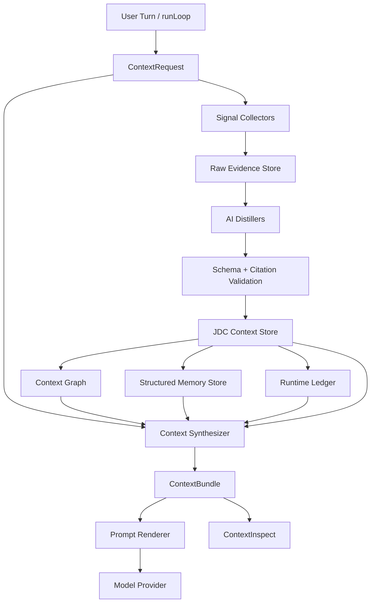

# JDC Context Engine Production Design

## Positioning

JDC Context Engine is a JDC-native context operating system for the agent runtime. It is not merely a code indexer, not a bag of memories, and not a collection of tools. Its job is to continuously turn project signals, code structure, conversation state, runtime events, and user memories into evidence-backed context bundles that the model can use safely.

The current JDC code intelligence surface remains part of the design, but it becomes one producer inside the larger engine:

- `JdcCodeProducer`: symbols, files, call graph, impact, traces, source snippets.
- `JdcContextEngine`: full orchestration layer that understands project, conversation, memory, runtime, IDE, git, and code together.

The product promise is:

> Before each model turn, JDC Context Engine knows what evidence matters, what is stale, what the user currently means, what project rules are active, what code is relevant, and why each injected context item is trustworthy.

## Core Thesis

Hardcoded data collection alone is not a production-grade context engine. Pure AI summarization alone is also unsafe. Production quality comes from the combination:

- Deterministic collectors gather raw evidence.
- AI distillers transform raw evidence into structured semantic records.
- Validators reject unsupported AI claims.
- Stores preserve citations, freshness, confidence, and scope.
- Synthesizers build compact per-turn context bundles under a strict token budget.
- Inspectors make every injected context item debuggable.

The engine should not ask the model to manually discover basic project context every turn. The model should receive a curated context substrate and use tools only for deeper exploration.

## Architecture



## Who Produces the Content

JDC Context Engine uses three kinds of producers.

### Deterministic Signal Producers

These producers do not summarize. They collect factual raw signals.

| Producer | Raw evidence | Example |
| --- | --- | --- |
| `CodeSignalProducer` | symbols, references, file paths, snippets | `ParallelExecutor.executeBatch` at `packages/core/src/parallel-executor.ts` |
| `GitSignalProducer` | diff, branch, commits, hot files | `main ahead origin/main by 2 commits` |
| `ProjectSignalProducer` | package files, scripts, config, docs | `pnpm workspace`, Electron app, core/ui packages |
| `IDESignalProducer` | current file, selection, diagnostics | selected code in active editor |
| `RuntimeSignalProducer` | tool events, errors, aborts, retries | `Read missing file -> sibling tools cancelled` |
| `ConversationSignalProducer` | recent messages, confirmed constraints | user wants JDC-native design, not generic providers |
| `MemorySignalProducer` | existing memory records | user/project preferences and conventions |

These producers are intentionally boring. They are the evidence layer.

### AI Distillation Producers

These producers use an LLM to turn raw evidence into structured context. They are where semantic understanding comes from.

| Distiller | Input | Output |
| --- | --- | --- |
| `ProjectProfileDistiller` | README, package files, configs, docs | project purpose, architecture, commands, package boundaries |
| `ArchitectureMapDistiller` | code graph + docs + package layout | modules, ownership, dependency direction, risky seams |
| `ConversationStateDistiller` | recent messages | current goal, active constraints, rejected options, open questions |
| `DecisionLedgerDistiller` | conversation + commits + plans | durable decisions with citations |
| `RuntimeNarrativeDistiller` | tool events + errors | root-cause chain for recent failures |
| `MemoryCuratorDistiller` | user statements + outcomes | scoped memory candidates with confidence |
| `CodeTaskDistiller` | user task + code candidates | relevant entry points and why they matter |

AI distillers do not get to invent facts. Every structured claim must cite raw evidence. Unsupported claims are either rejected or downgraded to low confidence.

### Human and System Authored Producers

Some context is explicitly authored:

- User instructions.
- Project docs.
- Superpower specs and plans.
- Saved memories.
- Rules files.
- Manual notes.

These records have high provenance but can still become stale, so they also carry freshness metadata.

## Core Data Model

```ts
export interface ContextRequest {
  sessionId: string
  cwd: string
  userMessage: string
  recentMessages: Message[]
  mode: 'chat' | 'debug' | 'code_edit' | 'review' | 'plan'
  model: string
  tokenBudget: number
  runtime: RuntimeSnapshot
  ide?: IdeSnapshot
}
```

```ts
export interface RawEvidence {
  id: string
  source: EvidenceSource
  kind: 'file' | 'git' | 'tool_event' | 'message' | 'memory' | 'ide' | 'config'
  content: string
  metadata: Record<string, unknown>
  capturedAt: number
  hash: string
}
```

```ts
export interface ContextFact {
  id: string
  kind:
    | 'project_profile'
    | 'architecture_decision'
    | 'module_boundary'
    | 'user_preference'
    | 'current_goal'
    | 'runtime_error_chain'
    | 'code_entrypoint'
    | 'known_issue'
    | 'workflow_rule'
  content: string
  citations: ContextCitation[]
  confidence: number
  freshness: 'live' | 'recent' | 'cached' | 'stale'
  scope: 'global' | 'project' | 'repo' | 'session' | 'turn'
  createdAt: number
  updatedAt: number
  expiresAt?: number
}
```

```ts
export interface ContextBundle {
  id: string
  requestHash: string
  sections: ContextSection[]
  diagnostics: ContextDiagnostic[]
  budget: {
    maxTokens: number
    usedTokens: number
    droppedTokens: number
  }
}
```

## AI Distillation Contract

Each AI distiller must use a strict schema. Free-form summaries are not acceptable as the storage format.

```ts
export interface DistillationJob<I, O> {
  name: string
  input: I
  schema: z.ZodSchema<O>
  requiredCitations: boolean
  maxOutputTokens: number
  freshnessPolicy: FreshnessPolicy
}
```

Distiller output is accepted only when:

- It validates against the schema.
- Every durable claim has at least one citation.
- File citations still exist.
- Message citations still exist in history.
- Memory writes include scope and confidence.
- The output does not contradict higher-priority live context.

Invalid output is stored only as a diagnostic, never injected as trusted context.

## Collection Timing and Harvest Policy

JDC Context Engine must not run expensive collection or AI distillation on every user message. A user saying "hi", "ok", "continue", or sending a tiny correction should not trigger project-wide analysis or memory writes.

The correct trigger is the completion of an agent runLoop, not message receipt.

During the foreground runLoop, the engine only uses cheap live context:

- current user message;
- existing context facts;
- active IDE context;
- current runtime state;
- recent tool errors;
- cached code/project/memory facts.

After the runLoop completes, the engine may enqueue a background harvest job. That job decides whether the completed turn contains durable value.

```ts
export interface HarvestCandidate {
  sessionId: string
  runLoopId: string
  userMessage: string
  assistantMessages: Message[]
  toolEvents: ToolExecutionEvent[]
  changedFiles: string[]
  createdAt: number
}
```

```ts
export type HarvestDecision =
  | { action: 'skip'; reason: SkipReason }
  | { action: 'distill_runtime'; reason: string }
  | { action: 'distill_conversation'; reason: string }
  | { action: 'distill_memory_candidate'; reason: string }
  | { action: 'distill_project_update'; reason: string }
```

Skip reasons are first-class data:

```ts
export type SkipReason =
  | 'greeting_or_smalltalk'
  | 'no_new_fact'
  | 'too_short'
  | 'duplicate_of_existing_context'
  | 'low_confidence'
  | 'sensitive_content'
  | 'rate_limited'
```

The harvest classifier should be mostly deterministic. AI is used only when the turn passes basic signal thresholds.

Hard skip examples:

- greetings;
- acknowledgements;
- "继续";
- "可以";
- short preference-free chat;
- model responses with no tools, no decisions, no code references, and no user correction.

Harvest examples:

- a bug root cause was found;
- a design decision was confirmed;
- the user stated a durable preference;
- files were edited;
- a tool failure chain occurred;
- a plan was approved or rejected;
- a project convention was discovered;
- a repeated correction indicates existing memory/context is wrong.

## Garbage Data Rejection

AI-generated context must be treated as a candidate, not accepted truth.

```ts
export interface ContextCandidate {
  id: string
  proposedBy: 'ai_distiller'
  fact: ContextFact
  validation: {
    schemaValid: boolean
    citationsValid: boolean
    duplicatesExisting: boolean
    conflictsExisting: boolean
    confidenceAccepted: boolean
  }
  status: 'candidate' | 'accepted' | 'rejected'
  rejectionReason?: string
}
```

A candidate is rejected when:

- it has no citation;
- it cites a missing file/message/tool event;
- it repeats an existing fact without adding evidence;
- it contradicts a higher-confidence fact;
- it tries to store a transient greeting or one-off phrasing;
- it has low confidence;
- it contains secrets or sensitive data;
- it has no clear scope;
- it is not useful for future turns.

Long-lived memory has a stricter bar than session context. A project convention or architecture decision should require either explicit user confirmation, repeated evidence, or a durable source such as a committed doc.

## Data Volume Control

The engine stores less than it observes.

Raw evidence is short-lived unless it supports an accepted fact. ContextBundle snapshots are bounded and mainly for debugging. Long-term records must be deduplicated and scoped.

Recommended retention model:

| Data class | Retention | Notes |
| --- | --- | --- |
| raw tool events | short TTL | keep enough for recent runtime explanations |
| raw conversation turns | existing history policy | do not duplicate full messages into context store |
| rejected candidates | short TTL | useful for debugging distiller quality |
| ContextBundle snapshots | bounded recent ring | for `JdcContextInspect` |
| accepted session facts | session lifetime | removed or compacted with session |
| project facts | until invalidated | invalidated by file/doc hash changes |
| user memories | durable | require scope, citation, confidence |

The store should enforce quotas:

- max accepted facts per session;
- max memory records per project;
- max runtime events retained;
- max ContextBundle snapshots retained;
- max tokens per stored summary;
- max candidate records per harvest cycle.

When the quota is exceeded, the engine compacts by evidence value, freshness, and frequency of reuse. It should not keep data just because an AI produced it.

## Context Store

JDC Context Store is not a simple memory file. It stores multiple record classes:

- Raw evidence records.
- Distilled context facts.
- Entity graph nodes.
- Entity graph relations.
- Conversation state snapshots.
- Runtime event chains.
- Memory records.
- ContextBundle snapshots for debugging.

The store must support:

- Query by scope.
- Query by citation.
- Query by freshness.
- Query by confidence.
- Query by relation.
- Invalidation by file hash, git commit, message id, or memory update.

## Context Graph

The graph connects project concepts, code entities, user decisions, and runtime events.

Examples:

- `ParallelExecutor` implements `parallel tool execution`.
- `JdcNode` is a `read-only context tool`.
- `Cancelled: sibling tool failed` caused by `batch abort policy`.
- User decision: `JDC Context Engine must remain the official name`.
- Project convention: `JDC Engine is JDC-native, not a generic provider system`.

This graph gives the engine project-level understanding beyond code symbols.

## Memory Model

Memory is a first-class structured context source, not a generic summary.

```ts
export interface MemoryRecord {
  id: string
  kind:
    | 'user_preference'
    | 'project_convention'
    | 'architecture_decision'
    | 'known_issue'
    | 'workflow_hint'
  scope: 'global' | 'project' | 'repo' | 'session'
  content: string
  citations: ContextCitation[]
  confidence: number
  createdAt: number
  updatedAt: number
  expiresAt?: number
}
```

AI may propose memory records, but the memory store decides whether to accept them. Acceptance requires evidence, scope, and conflict checks.

## Per-Turn Synthesis

Before each model turn, the engine builds a `ContextBundle`.

The bundle is not a dump of everything known. It is a ranked, token-budgeted selection:

- Latest user instruction.
- Current task state.
- Live runtime errors relevant to the task.
- Active IDE context.
- Relevant project facts.
- Relevant memories.
- Relevant code entry points.
- Git state if the task touches files.

The model sees a compact rendered version:

```xml
<jdc-context-engine bundle="ctx_abc">
  <current-goal confidence="0.94">
    User is evaluating production-grade design for JDC Context Engine.
  </current-goal>
  <active-decisions>
    - The system name must remain JDC Context Engine.
    - Providers are internal producers, not user-facing generic tools.
  </active-decisions>
  <runtime-state>
    Recent issue: read-only tool failure cancelled sibling JDC tool results.
  </runtime-state>
  <relevant-code>
    - ParallelExecutor.executeBatch — packages/core/src/parallel-executor.ts
  </relevant-code>
</jdc-context-engine>
```

## Tool Surface

Most context production is internal. The tool surface stays small.

Required tools:

- `JdcContextInspect`: show the exact bundle, dropped context, provider errors, citations, and token cost.
- `JdcContextSearch`: query stored context facts and memories.
- `JdcContextRefresh`: force refresh of project/code/memory/runtime context.
- `JdcMemoryWrite`: write structured memory with citations.
- Existing `Jdc*` code tools: deep code exploration.

Tools are for inspection and deep exploration. They are not the primary context production path.

## Protocol and Model Binding

JDCAGNET supports multiple model protocols. JDC Context Engine must treat protocol support as a first-class runtime concern:

- Anthropic Messages;
- OpenAI Chat Completions;
- OpenAI Responses.

All foreground context injection should pass through the same JDC context protocol before it reaches a provider adapter. The context protocol is model-agnostic; provider adapters are responsible for rendering it into the target API shape.

Async harvest must use the current session's model binding. It must not silently use a global default model or a cheaper hidden model unless the user explicitly configures that behavior.

```ts
export interface HarvestModelBinding {
  sessionId: string
  providerProtocol: 'anthropic' | 'openai-chat' | 'openai-responses'
  modelId: string
  modelConfig: ModelConfig
  modelGroupId?: string
  baseUrl?: string
  contextWindow?: number
}
```

The binding is captured at the end of the runLoop that produced the harvest candidate. This prevents later model changes from rewriting the meaning of older context harvest jobs.

Harvest jobs use the same provider abstraction as normal model calls, but with a restricted prompt contract:

- no file tools;
- no mutation tools;
- structured JSON output only;
- strict schema validation;
- citation requirement;
- short max output;
- timeout and cancellation support.

This keeps harvest behavior consistent across all three protocols while avoiding provider-specific tool semantics.

## Thinking and Reasoning Data Policy

Model thinking/reasoning output is not a stable data source. Some protocols expose thinking, some expose reasoning summaries, some expose nothing, and some models may change behavior by configuration.

JDC Context Engine must not depend on raw thinking data to produce durable context.

Rules:

- Raw thinking is not stored as project memory.
- Raw thinking is not accepted as citation evidence.
- Raw thinking is not required for harvest.
- Raw thinking is not shown in ContextInspect by default.
- If a provider exposes an explicit reasoning summary, it may be retained only as ephemeral run diagnostics.
- Durable facts must be based on user messages, assistant final content, tool calls, tool results, files, git state, IDE state, or accepted project documents.

```ts
export interface ReasoningCapturePolicy {
  captureRawThinking: false
  captureReasoningSummary: 'never' | 'ephemeral_diagnostics'
  allowAsCitation: false
  allowAsMemorySource: false
}
```

This policy prevents context quality from depending on non-portable provider behavior.

## Runtime Integration

The runLoop uses JDC Context Engine before model streaming:

- Build `ContextRequest`.
- Load live evidence.
- Retrieve relevant stored facts.
- Run only cheap live distillers synchronously.
- Use cached durable distillations when fresh.
- Render `ContextBundle`.
- Attach the bundle to the model prompt.

After the model turn:

- Tool events are written to the runtime ledger.
- Conversation state is distilled asynchronously.
- Memory candidates are proposed asynchronously.
- Project facts are refreshed only when files or docs change.
- Harvest jobs run with the captured current-session model binding.
- Harvest jobs ignore raw thinking and use only stable evidence.

This keeps the foreground turn fast while still making the engine smarter over time.

## Frontend Interaction Design

Frontend interaction is part of production readiness, but it should remain negotiable and progressively adjustable. The engine should expose enough UI to make context behavior understandable without forcing normal users to manage internals.

Required surfaces:

- `ContextInspect`: view the exact context bundle injected into a turn.
- `Harvest Queue`: show pending, accepted, skipped, and rejected harvest jobs.
- `Memory Review`: show AI-proposed memories before or after acceptance depending on configured trust mode.
- `Provider Health`: show which producers are enabled, stale, failed, or rate-limited.
- `Context Controls`: per-session toggles for memory, project context, runtime context, IDE context, and code context.

Useful advanced surfaces:

- context timeline for a session;
- why-this-context explanation;
- citation drilldown;
- stale context warnings;
- memory conflict review;
- provider latency and token cost view.

The default UI should stay quiet. Advanced context controls should live behind an inspect/debug affordance so the product does not feel heavier for normal chat.

## Production Safety Guarantees

JDC Context Engine must never make the product harder to use.

Guarantees:

- Provider failure does not block chat.
- Distiller failure does not block chat.
- Store failure falls back to existing prompt behavior.
- Low-confidence facts are marked, not hidden.
- Stale facts are marked, not silently trusted.
- User's latest instruction outranks all memory.
- Runtime live state outranks cached summaries.
- Secrets are redacted before distillation.
- Large source snippets are not auto-injected.
- Every injected durable fact has provenance.
- Context injection can be disabled per provider.

## Anti-Hallucination Rules

AI distillation is powerful but dangerous. The engine must enforce:

- No citation, no durable fact.
- No source hash match, no live file claim.
- No message id, no conversation decision claim.
- No scope, no memory write.
- No confidence, no injection.
- Conflicting facts are surfaced as diagnostics.
- User correction downgrades or invalidates prior facts.

AI summarizes, but the engine verifies.

## Observability

Production-grade means every context decision is inspectable.

`JdcContextInspect` must show:

- Final rendered context.
- Raw sections before compression.
- Provider timings.
- Distiller timings.
- Token budget usage.
- Dropped sections and drop reason.
- Stale sections.
- Low-confidence sections.
- Citation list.
- Store query results.
- Distiller validation errors.

Without this, context bugs become invisible model behavior bugs.

## Evaluation Requirements

The engine needs permanent evals:

- Relevant file recall.
- Wrong file injection rate.
- Token overhead.
- Tool-call reduction.
- Stale memory incidents.
- User correction rate.
- Runtime error explanation accuracy.
- Architecture summary accuracy.
- Code edit success with and without context bundle.

Eval cases must include large repositories, stale memories, conflicting project docs, missing files, renamed symbols, failed tool chains, and user corrections.

## Why This Is JDC-Native

This design is not a generic RAG layer. It is JDC-specific because it understands:

- JDC runLoop.
- JDC tool events.
- JDC code tools.
- JDC team/agent runtime.
- JDC memory.
- JDC plans and superpower docs.
- JDC project workspaces.
- JDC UI inspection needs.

The unique product value is not "we retrieve files." The unique value is:

> JDC Context Engine understands the live working state of the agent, the user, the project, the tools, and the code at the same time.

That is the production-grade version of the original design.
