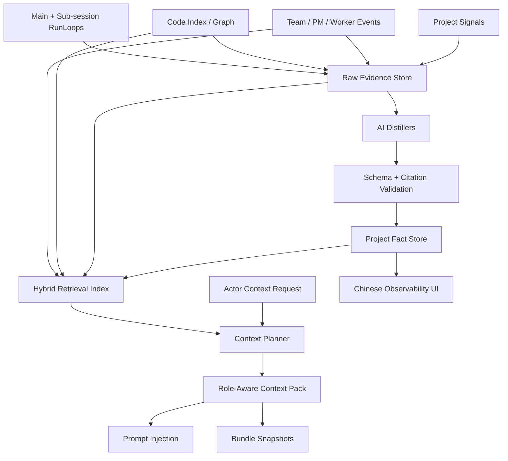

# JDC Context Engine V2 Design

## Status

This document defines the V2 design for `JDC Context Engine`.

The goal is to upgrade the current implementation in place. This is not a rewrite. Existing code intelligence tools, project-local storage, context providers, prompt injection, harvest jobs, and Team/sub-agent integration remain, but their contracts become stricter and more project-centered.

## Product Positioning

`JDC Context Engine` is the project-level context operating system for JDCAGNET.

It is not only a memory tool, not only a code index, not only a debug inspector, and not a generic provider framework. It is the layer that lets the main assistant, sub-agents, Team PM, and workers share the same project understanding without dumping raw chat history or every memory item into the model context.

The product promise is:

> In the same project, every session and every agent starts with the right project understanding, retrieves deeper knowledge when needed, and leaves behind only evidence-backed context that makes the project easier to work on next time.

## Non-Negotiables

- The product name remains `JDC Context Engine`.
- Accepted durable facts are project-level by default and are shared across sessions in the same project.
- Different projects must never share facts, context packs, raw evidence, Team artifacts, or retrieval results.
- All persistent engine data lives under the active project root, primarily `.jdcagnet/context-engine/`.
- `sessionId`, `teamId`, `memberId`, and `taskId` are provenance fields, not isolation boundaries for accepted project facts.
- The engine must not inject all memories.
- The engine must not inject raw chat history except for short, bounded conversation state.
- The engine must not use a tiny fixed prompt cap such as 2.5k tokens for production context. Context capacity should not be artificially limited by the engine; selection is relevance-based and final request sizing is handled by provider/model protocol constraints.
- The engine must not store raw hidden reasoning or model thinking.
- Durable facts must have citations, confidence, freshness, and provenance.
- The engine must be useful without the user manually pressing refresh, reindex, inspect, or memory review buttons.
- Foreground chat must not block on harvest, indexing, semantic search, or Team summarization.
- Context failures must degrade silently and save diagnostics; they must not fail the user runLoop.
- UI is Chinese-first for user-facing labels and must show useful final state, not internal garbage rows.
- Prompt identity must be JDCAGNET/JDC Context Engine first. Provider adapters must not prepend a conflicting "Claude Code" identity unless an explicit compatibility mode asks for it.

## Current Baseline

The current implementation already has important pieces:

- Project-local `ContextStore` under `.jdcagnet/context-engine/context.db`.
- `ContextFact`, `RawEvidence`, `ContextBundle`, `HarvestJob`, diagnostics, and provider health types.
- Foreground `buildContextBundle()` injection before model streaming.
- Async harvest after main runLoop and sub-session runs.
- Model-bound distillers with protocol support for Anthropic, OpenAI Chat, and OpenAI Responses.
- `JdcMemorySearch` and `JdcMemoryWrite`.
- Code tools such as `JdcContext`, `JdcSearch`, `JdcNode`, `JdcImpact`, and related call-graph tools.
- Team worker execution through `runSubSession()`, which can receive Context Engine dependencies.

The important gap is that the system still behaves like a bundle assembler plus memory store. It does not yet behave like a project context operating system.

## Core V2 Thesis

V2 must split context into four layers:

1. **Evidence Layer**
   Deterministic raw signals: files, git, IDE, tool events, team artifacts, task results, user messages, release workflow, package config, and diagnostics.

2. **Knowledge Layer**
   AI-distilled, validated, citation-backed facts: project profile, workflow rules, architecture decisions, known issues, module boundaries, active project goals, Team decisions, artifact summaries, and QA results.

3. **Retrieval Layer**
   Indexed lookup over facts, evidence, code graph, citations, paths, Team artifacts, and project terms. This layer answers "what matters for this actor and this task?"

4. **Context Pack Layer**
   A role-aware prompt payload injected into the main session, PM, worker, or sub-agent. It contains the top relevant facts and citations without an engine-level tiny token ceiling; relevance, protocol correctness, and provider request validity decide the final payload.

The engine should store more than it injects. It should retrieve more than it stores in each prompt. It should show less than it knows.

## Phase 0 Capacity And Runtime Baseline

Before retrieval, Team ledger, or UI work, V2 must fix the current capacity/runtime floor. Otherwise the engine can collect useful data but still feel "dumb" because providers time out, project files are over-summarized, memories are never supplied, or prompt identity conflicts with the JDC product.

### Context Capacity Contract

The current hard defaults are too small for a production coding agent:

```ts
tokenBudget: {
  maxBundleTokens: 2500,
  maxSectionTokens: 700,
  maxCodeTokens: 900,
}
```

V2 must replace this with a no-artificial-cap capacity resolver:

- Remove the engine-level 2.5k/700/900 ceilings from production defaults.
- Do not hard-cap the JDC Context Engine pack at 8k, 32k, or any other arbitrary product number.
- The pack builder should select all relevant, cited, non-stale context that the actor/task needs, then pass it through the provider adapter using that provider's valid request shape.
- Provider adapters must preserve protocol correctness and prevent malformed requests. Anthropic system prompt blocks, cache breakpoints, content arrays, and tool/result structures must follow the official SDK/API shape to avoid 400 errors.
- If a provider/model rejects oversize requests, the fallback path is protocol-safe degradation with diagnostics and retry, not a small default cap hidden inside the engine.
- Legacy fields such as `maxBundleTokens`, `maxSectionTokens`, and `maxCodeTokens` may remain parseable for backward compatibility, but JDC Context Engine must not enforce them as local bundle, section, code, project-doc, fact, or memory limits.
- The engine still must not inject all memories. Large capacity means better retrieval packs, not unbounded memory dumps.
- Every injected pack records `budget.used`, `providerLimitObserved`, `droppedByReason`, and `retryReason` so the UI and evals can prove whether information was selected, excluded by relevance, or degraded by provider request limits.

Production defaults should remove artificial limits:

```ts
{
  maxBundleTokens: undefined, // compatibility field only; not enforced
  maxSectionTokens: undefined, // compatibility field only; not enforced
  maxCodeTokens: undefined, // compatibility field only; not enforced
  selectionMode: 'relevance_first',
  providerOverflowPolicy: 'degrade_and_retry',
}
```

This is not permission to dump irrelevant data. It means JDC Context Engine no longer cripples itself before the provider/model even sees the project context.

### Provider Runtime Contract

The current provider timeouts are too aggressive for real project signals:

```ts
performance: {
  providerTimeoutMs: 120,
  degradedProviderTimeoutMs: 200,
}
```

V2 must use a two-speed runtime:

- Foreground provider reads use cached/indexed data and a realistic soft timeout, starting around 1-1.5s.
- Foreground injection must never start full indexing or model harvest.
- Background refresh/indexing can run longer, but must be scheduled, cancellable, and project-budgeted.
- Provider health must distinguish "not indexed yet", "background indexing", "cached", "stale", and "failed" without making users click reindex.
- Panel reads must not trigger heavy jobs.

### Required Provider Fixes

- `memory-provider.ts` cannot remain an empty provider. It must read accepted project facts through retrieval and emit relevance-selected `memory` sections with citations.
- `project-provider.ts` cannot summarize `JDCAGNET.md`, `AGENTS.md`, or `README.md` using only the first three non-empty lines. It must parse structured headings, scripts, conventions, and relevant sections into meaningful project evidence.
- `git-provider.ts` should keep its richer hot-file signals, but also include direct branch/status/log style facts so models see the same immediate repo state a CLI coding agent would see.
- Code provider must serve from index/snapshot in foreground and schedule background indexing when needed instead of blocking the tool path.

### Prompt And Model Adapter Contract

- `resolveStreamSystemPrompt()` and `resolveSystemPrompt()` must be semantically equivalent for cacheable/dynamic context layout.
- Anthropic provider must not prepend a Claude persona ahead of the JDC identity in normal JDCAGNET operation.
- Anthropic request construction must follow the official Anthropic Messages API / SDK shape. This includes valid `system` blocks, cache control placement, content block arrays, tool result blocks, and dynamic context placement. Avoiding 400 errors is a hard acceptance criterion.
- Existing adaptive thinking behavior is not part of this phase. Do not change it in Phase 0.
- OpenAI Chat and OpenAI Responses must receive the same JDC Context Engine payload semantics, including project packs and non-cacheable dynamic context markers where applicable.

## High-Level Architecture



## Data Model V2

### Project Key

The normalized project root is the project identity.

```ts
export interface ProjectIdentity {
  projectKey: string
  root: string
  displayName: string
  gitRemote?: string
  createdAt: number
  updatedAt: number
}
```

The engine must use the active session `cwd` to open the store. `process.cwd()` is never acceptable as a default for user project facts.

### Provenance

Every durable record needs provenance that can represent main sessions, sub-agents, Teams, PM, workers, tasks, and artifacts.

```ts
export interface ContextOrigin {
  projectKey: string
  sessionId?: string
  runLoopId?: string
  subSessionId?: string
  teamId?: string
  memberId?: string
  taskId?: string
  artifactId?: string
  toolUseId?: string
  messageId?: string
  providerProtocol?: 'anthropic' | 'openai-chat' | 'openai-responses'
  modelId?: string
}
```

This replaces the current weak pattern where `sessionId` is present but Team/worker/task origin is mostly implicit.

### Evidence

```ts
export type EvidenceKind =
  | 'file'
  | 'git'
  | 'tool_event'
  | 'message'
  | 'memory'
  | 'ide'
  | 'config'
  | 'task'
  | 'team_event'
  | 'team_artifact'
  | 'team_contract'
  | 'team_issue'
  | 'diagnostic'
```

```ts
export interface RawEvidenceV2 {
  id: string
  origin: ContextOrigin
  sourceProvider: string
  kind: EvidenceKind
  content: string
  metadata: Record<string, unknown>
  capturedAt: number
  hash: string
  expiresAt?: number
}
```

Raw evidence is not automatically trusted context. It is a citation source.

### Facts

```ts
export type ContextFactKindV2 =
  | 'project_profile'
  | 'architecture_decision'
  | 'module_boundary'
  | 'user_preference'
  | 'known_issue'
  | 'project_convention'
  | 'workflow_rule'
  | 'code_entrypoint'
  | 'active_project_goal'
  | 'team_decision'
  | 'task_result'
  | 'artifact_summary'
  | 'qa_issue'
  | 'release_process'
```

```ts
export interface ContextFactV2 {
  id: string
  origin: ContextOrigin
  kind: ContextFactKindV2
  scope: 'global' | 'project' | 'repo'
  content: string
  summary?: string
  tags: string[]
  relatedFiles: string[]
  relatedSymbols: string[]
  relatedTasks: string[]
  citations: ContextCitation[]
  confidence: number
  freshness: 'live' | 'recent' | 'cached' | 'stale'
  sourceProvider: string
  createdAt: number
  updatedAt: number
  expiresAt?: number
}
```

`session` and `turn` scope should remain available for ephemeral bundle sections, but not for accepted durable project facts. A fact that cannot safely cross sessions should not be accepted as a durable project fact.

### Retrieval Records

```ts
export interface RetrievalRecord {
  id: string
  projectKey: string
  sourceType: 'fact' | 'evidence' | 'code_symbol' | 'file' | 'team_artifact'
  sourceId: string
  title: string
  text: string
  tags: string[]
  fileRefs: string[]
  symbolRefs: string[]
  lexicalTerms: string[]
  embedding?: number[]
  updatedAt: number
  freshness: 'live' | 'recent' | 'cached' | 'stale'
}
```

Embedding support may be implemented later, but the V2 contract must leave room for it. The initial implementation can use lexical scoring, citation/path matching, code graph affinity, and recency.

## Storage Contract

All storage remains project-local:

```text
.jdcagnet/context-engine/
  context.db
  index/
    lexical.json or lexical.db
    embeddings.db optional
  snapshots/
    latest-context-pack.json optional
  diagnostics/
    recent.json optional
```

The SQL store should own durable facts, evidence, harvest jobs, diagnostics, bundle snapshots, retrieval index metadata, and Team context records. File-based auxiliary indexes are acceptable only if they are project-local and rebuildable from `context.db` plus code index state.

Required new tables or equivalent schema:

- `context_origins`
- `retrieval_records`
- `team_context_records`
- `context_pack_snapshots`
- `context_fact_links`

The existing tables can be migrated in place. Facts without explicit origin get backfilled from current `sessionId`, citation metadata, and project key.

## Producers

### Existing Producers To Keep

- Code provider.
- Project provider.
- Git provider.
- IDE provider.
- Runtime provider.
- Conversation provider.
- Memory/project facts loader.

### New V2 Producers

#### Team Ledger Producer

Reads Team runtime events and `.team/` workspace records:

- objective;
- PM decisions;
- task creation and assignment;
- worker progress;
- task completion;
- team artifacts;
- contracts;
- QA issues;
- team synthesis;
- archived team workspace path.

It emits `team_event`, `team_artifact`, `team_contract`, `team_issue`, and `task` evidence.

#### Artifact Producer

Watches or records `team_artifact` writes. Each artifact gets:

- title;
- owner worker;
- task id;
- file path;
- one-sentence summary;
- related files;
- related contracts;
- status.

#### Workflow Producer

Detects project workflows and operational rules:

- `.github/workflows/*`;
- package scripts;
- release tags;
- build/signing scripts;
- extension packaging scripts.

The release process should not be stored only as a manual memory. It should be derivable from workflow files and validated against them.

#### Project State Producer

Maintains a compact project state:

- current active initiatives;
- unresolved known issues;
- recent decisions;
- current release/version state;
- important pending QA items;
- project health warnings.

## Distillers

V2 distillers must support skip/noop as a first-class valid output. No distiller should force a memory candidate when no durable fact exists.

Required distillers:

- `ProjectProfileDistiller`
- `ArchitectureMapDistiller`
- `WorkflowRuleDistiller`
- `MemoryCuratorDistiller`
- `ConversationStateDistiller`
- `RuntimeNarrativeDistiller`
- `TeamLedgerDistiller`
- `TaskResultDistiller`
- `ArtifactSummaryDistiller`
- `QAIssueDistiller`

Distiller outputs are accepted only when:

- schema validates;
- citations exist;
- file citations match current or known historical hash;
- confidence meets policy;
- content is not a duplicate;
- content does not contain raw hidden reasoning;
- content is not a secret;
- content has project value beyond the current turn.

## Harvest Triggers

Harvest should be event-driven and budgeted.

### Main Session

Trigger after a completed runLoop when:

- assistant produced a substantive response;
- tool events include file/code/git/runtime evidence;
- user explicitly stated a durable preference or project rule;
- the conversation changed project goals, decisions, constraints, or known issues.

Do not trigger on small talk, acknowledgements, repeated "continue", or pure UI waits.

### Sub-Agent

Trigger after sub-session completion when:

- the result contains code findings;
- the result answers a project-level question;
- the result creates or verifies a durable decision;
- the result exposes a known issue or workflow rule.

### Team PM

Trigger when:

- PM creates or changes the objective;
- PM creates a contract task;
- PM resolves a worker conflict;
- PM files or resolves a QA issue;
- PM completes the team synthesis.

### Worker

Trigger when:

- worker writes `team_artifact`;
- worker marks task completed;
- worker reports a blocker;
- worker files a QA issue;
- worker modifies code with a persistent implication.

### File Changes

Trigger deterministic invalidation, not model harvest:

- file citation hash changed;
- workflow file changed;
- package script changed;
- docs/spec changed;
- `.team/` artifact changed.

Model harvest may run later if the changed file is a high-value context source.

## Retrieval Layer

V2 retrieval must be hybrid:

1. **Lexical retrieval**
   Token overlap, Chinese terms, English identifiers, camelCase splitting, path terms.

2. **Citation/path retrieval**
   File paths, workflow names, symbol names, tool ids, task ids, artifact ids.

3. **Semantic retrieval**
   Optional initially, required as a future extension point. The contract must support embeddings even if the first implementation uses lexical scoring.

4. **Code graph affinity**
   If a memory references a file or symbol, nearby symbols/files should raise relevance.

5. **Actor-aware reranking**
   Main session, PM, worker, and sub-agent need different context.

6. **Freshness and confidence gates**
   Stale facts are excluded by default unless explicitly requested or needed for historical explanation.

Memory retrieval rule:

> Automatic injection may include only the top relevant accepted facts. All other accepted facts stay indexed and are retrieved through `JdcMemorySearch` or internal retrieval.

Production selection default:

- project primer: include the useful structured project summary, not only a tiny fixed excerpt;
- active project state: include current goals, workflow state, known blockers, and recent durable decisions when relevant;
- project facts: retrieve by relevance and citations, not by recency or a fixed five-fact cap;
- team/task context: include durable PM/worker/task summaries when relevant to the actor;
- code context: include relevant indexed code/file/symbol context without the old 900-token ceiling;
- citations: keep citations compact, but do not drop evidence-backed content only because a small local cap was reached.

The retrieval layer must still reject irrelevant or stale data. "No artificial token cap" means no engine-imposed tiny ceiling; it does not mean every memory or every raw file enters the prompt.

## Context Packs

```ts
export interface ActorContextRequest {
  projectKey: string
  actor:
    | { type: 'main_session'; sessionId: string }
    | { type: 'sub_agent'; sessionId: string; subSessionId: string; agentType: string }
    | { type: 'team_pm'; sessionId: string; teamId: string }
    | { type: 'team_worker'; sessionId: string; teamId: string; memberId: string; taskId: string }
  userMessage?: string
  objective?: string
  taskPrompt?: string
  mode: 'chat' | 'debug' | 'code_edit' | 'review' | 'plan'
  tokenBudget: number
}
```

```ts
export interface ContextPack {
  id: string
  requestHash: string
  actor: ActorContextRequest['actor']
  sections: ContextSection[]
  citations: ContextCitation[]
  retrievalDiagnostics: ContextDiagnostic[]
  budget: ContextTokenBudget
  createdAt: number
}
```

### Main Session Pack

Contains:

- project primer;
- active project state;
- relevant durable facts;
- current IDE/runtime/git signals;
- relevant code hints;
- Team completion summaries if relevant.

Does not contain:

- full Team logs;
- raw worker messages;
- all memories;
- failed harvest diagnostics.

### Sub-Agent Pack

Contains:

- project primer;
- task-specific relevant facts;
- relevant code map;
- constraints from main session;
- upstream facts needed for the sub-agent task.

Does not contain:

- unrelated recent chat;
- full memory list;
- PM internal logs unless assigned team context.

### Team PM Pack

Contains:

- team objective;
- project primer;
- active project constraints;
- task graph state;
- worker states;
- open issues;
- contracts;
- artifact summaries;
- relevant project facts.

Does not contain:

- all source snippets;
- raw worker text beyond bounded recent events;
- unrelated memory.

### Team Worker Pack

Contains:

- assigned task;
- file scope;
- upstream dependencies and contracts;
- relevant artifact summaries;
- project rules needed for this task;
- relevant code/file hints.

Does not contain:

- full PM prompt;
- other workers' unrelated tasks;
- all team events;
- all project facts.

## Tool Boundary

### Model-Visible Tools

Keep:

- `JdcContext`
- `JdcSearch`
- `JdcNode`
- `JdcCallers`
- `JdcCallees`
- `JdcImpact`
- `JdcTrace`
- `JdcExplore`
- `JdcFiles`
- `JdcMemorySearch`
- `JdcMemoryWrite`

`JdcMemorySearch` should search indexed accepted facts and artifact summaries, not only raw fact content.

`JdcMemoryWrite` remains for explicit user-approved saves, but normal durable memory should come from harvest.

### Internal-Only Tools / APIs

Keep internal or UI-only:

- context inspect;
- context refresh;
- provider health;
- reindex;
- harvest queue diagnostics;
- memory review admin actions.

The model should not waste context window calling internal inspection unless explicitly debugging the engine.

## UI Contract

The production UI should communicate engine value without making the user manage it.

Primary Chinese tabs:

- `项目理解`
- `项目记忆`
- `当前上下文`
- `引擎状态`

Developer-only tabs:

- `采集记录`
- `诊断`
- `Provider Health`
- raw bundle inspect.

Primary UI shows:

- accepted project facts;
- current project understanding;
- active release/workflow rules;
- known issues;
- recent Team summaries;
- confidence/freshness in Chinese;
- subtle "本轮已注入 N 条项目事实" status.

Primary UI does not show:

- skipped harvest;
- model noop;
- aborted harvest;
- failed distiller JSON;
- raw diagnostics;
- every rejected candidate.

Manual controls should be diagnostic-only. Normal users should not need to click refresh or reindex.

## Performance Contract

Foreground budget:

- context pack assembly should prefer cached/indexed data and avoid model calls;
- provider soft timeout should be realistic for real project signals, starting around 1-1.5s rather than 120ms;
- if foreground collection cannot finish in time, return a protocol-safe partial pack and schedule background refresh;
- no model calls in foreground injection;
- no full code indexing in foreground tool path;
- no full memory dump in foreground; retrieval/indexed lookup chooses relevant records.

Background budget:

- one expensive background context job per project by default;
- harvest debounce per project and per actor;
- Team event harvest batches multiple events;
- model harvest timeout enforced;
- aborted/timeout harvest saves diagnostics only, not user-visible memory rows.

Storage budget:

- retain accepted facts by quota and freshness;
- retain bundle snapshots with cap;
- retain raw evidence by TTL;
- retain Team summaries and artifact references longer than raw Team event logs;
- run quota enforcement after writes and scheduled maintenance.

CPU budget:

- project open may warm code index after idle delay;
- large repo indexing uses adaptive concurrency;
- branch switch invalidates affected files incrementally;
- UI panel loads cached state first and refreshes asynchronously.

## Team / PM / Worker Integration

Team Mode is a first-class context producer.

### PM

PM decisions become evidence. Durable PM conclusions become facts only after distillation and validation.

Examples:

- "前端和后端任务必须串行，因为共享 `packages/ui/src/stores/session-store.ts`" -> `team_decision`.
- "发布前必须跑 pnpm build 和 UI build" -> `workflow_rule` if cited by workflow/package evidence.

### Worker

Worker outputs become evidence through `team_artifact` and task completion.

Examples:

- task result summary -> `task_result`;
- QA bug -> `qa_issue`;
- generated contract -> `artifact_summary` or `module_boundary`;
- code finding with citation -> `known_issue`.

### Main Session

The main session should not redo Team work. It receives Team final synthesis and relevant project facts. On future sessions, accepted Team-derived facts are available through the project retrieval index.

## Migration Strategy

V2 migration should be incremental:

1. Remove artificial context caps and fix provider/protocol runtime contracts.
2. Add provenance fields and retrieval records without breaking existing facts.
3. Backfill old facts with project origin and tags.
4. Replace broad memory injection with retrieval-first project fact selection.
5. Add Team evidence ingestion.
6. Add actor-aware context pack requests.
7. Add workflow/release producer.
8. Move UI to final-state Chinese-first surfaces.
9. Add evals and performance budgets.

No migration should erase accepted facts. If a migration cannot classify a record, it keeps the record and marks origin as project/session provenance with low metadata detail.

## Testing And Evals

Required test categories:

- same-project cross-session accepted fact reuse;
- different-project isolation;
- context engine injection is not capped by the old 2.5k/700/900 defaults;
- provider collection does not degrade to empty context because of a 120-200ms timeout;
- `memory-provider.ts` emits accepted retrieved project facts instead of empty sections;
- `project-provider.ts` preserves meaningful `JDCAGNET.md` / `AGENTS.md` / `README.md` content beyond the first three lines;
- Anthropic system prompt construction follows valid official request shape and keeps JDC identity first;
- memory top-K injection under many facts;
- `JdcMemorySearch` retrieval for old but relevant facts;
- stale file citation invalidation;
- Team artifact -> evidence -> fact -> future session retrieval;
- PM decision -> project fact only with citation;
- worker task result -> task fact with team provenance;
- no raw hidden reasoning persistence;
- no foreground model harvest;
- no full indexing on foreground context assembly;
- UI hides diagnostics in production;
- Chinese user-facing context UI labels;
- protocol parity for Anthropic, OpenAI Chat, and OpenAI Responses.

Product evals:

- asking "我们的发布流程是咋样的" retrieves release workflow facts without reading every memory;
- asking in a new session uses accepted project facts from the same project;
- asking in a different project does not use the old project's release flow;
- Team-created QA issue is remembered as a known project issue;
- old stale workflow fact is excluded after `.github/workflows/release.yml` changes.

## Success Criteria

V2 is successful when:

- the model consistently feels more project-aware across sessions;
- memory count can grow without prompt bloat;
- Team work improves future sessions;
- PM and workers receive different, task-appropriate context packs;
- context failures are invisible to normal user workflow;
- UI reads like a helpful Chinese project understanding panel, not a manual debug console;
- CPU usage remains budgeted during normal chat and project startup, and token usage remains observable and protocol-safe without an artificial engine cap;
- every durable fact can answer: "who produced this, from what evidence, when, and why is it still fresh?"

## Explicit Non-Goals

- Do not build a remote cloud memory service.
- Do not require user-managed memory approval for every high-confidence project fact.
- Do not expose full raw context bundles in production UI.
- Do not store hidden model thinking.
- Do not make Team Mode depend on Context Engine to start.
- Do not replace existing JDC code tools; upgrade their relationship with retrieval.
- Do not force semantic embeddings before lexical/citation retrieval is working.

## Recommended Implementation Shape

V2 should be delivered in phases, but the design contract is one system:

0. Capacity, provider runtime, and protocol hardening.
1. Retrieval-first memory injection.
2. Provenance and schema expansion.
3. Actor-aware context packs.
4. Team ledger ingestion.
5. Workflow/release producer.
6. Chinese-first production UI.
7. Performance and eval hardening.

The most important first change is Phase 0. It makes sure the engine can actually deliver project context into model requests without crippling itself through tiny internal caps, empty providers, over-short timeouts, or invalid provider prompt construction. Retrieval-first memory injection comes immediately after that and prevents irrelevant memory dumps while preserving a large useful project pack.
