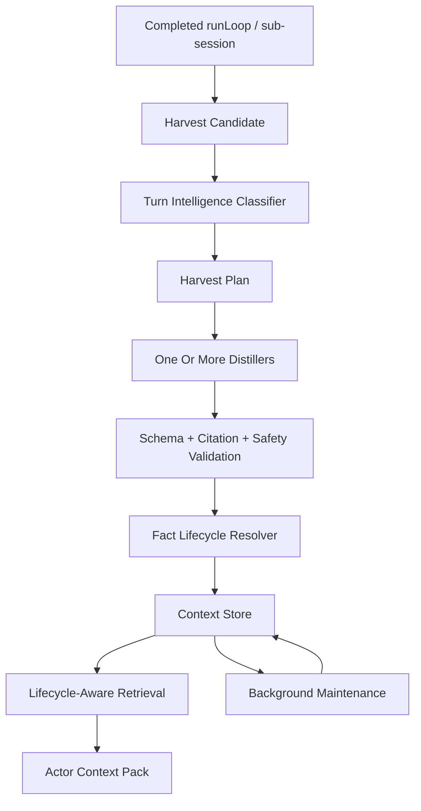

# JDC Context Engine Smart Harvest And Memory Lifecycle Design

## Status

This document extends the existing `JDC Context Engine` V2 design. It does not replace the current store cleanup, quota enforcement, stale invalidation, retrieval, harvest scheduler, or project-local persistence rules.

The goal is to make the context system feel intelligent in normal work:

- assistant-generated project understanding becomes durable context when it is useful;
- repeated facts are merged instead of duplicated;
- old facts become stale, superseded, conflicted, or archived instead of silently polluting future prompts;
- harvest failures are recoverable and inspectable without blocking foreground chat.

## Current Baseline

The implementation already has important built-in cleanup and safety behavior:

- `ContextStore.enforceQuotas()` deletes expired raw evidence, overflow bundle snapshots, expired or overflow rejected candidates, and overflow facts.
- Accepted durable project facts must have no default count cap. Store retention may still clean temporary or operational records such as raw evidence, bundle snapshots, rejected candidates, and diagnostics. Any explicit maintenance quota for accepted facts must be opt-in and visible, not a hidden product default.
- `invalidateByFileHash()` marks file-cited facts stale when the cited file hash no longer matches.
- Fact queries exclude stale facts by default unless `includeStale` or an explicit stale query is requested.
- Harvest calls `enforceQuotas()` after accepted, pending, rejected, and skipped outcomes.
- Foreground context orchestration also calls quota enforcement and records diagnostics.

This baseline is storage hygiene and basic invalidation. It is necessary, but it is not enough for intelligent long-lived project memory.

Phase 0 of this work must audit existing retention behavior. In particular, accepted durable project facts must not be silently discarded merely because the project accumulated more knowledge. If physical cleanup is required for storage health, the engine should prefer lifecycle status, archival, compaction, diagnostics, and explicit maintenance policy over hidden default deletion of accepted project understanding.

## Problem

The current system can harvest after a runLoop, but it still behaves too much like a queue plus store:

- routing is mostly driven by the latest user message;
- assistant summaries are not treated as first-class project knowledge signals;
- a useful project-wide summary can become `model_noop` or only a session-level conversation fact;
- short confirmations such as "save it", "of course", or "当然" do not reliably backfill the previous useful assistant turn;
- duplicate and overlapping facts are not canonicalized;
- replacement, conflict, and archive semantics are not first-class;
- stale state exists, but there is no full lifecycle model around active, superseded, conflicted, or archived facts;
- stuck harvest jobs can remain in intermediate states after interruption.

The user experience gap is simple: the engine can hear a useful project explanation and still fail to remember the important reusable parts.

## Product Goal

`JDC Context Engine` should become an intelligent project context operating system.

It should:

- notice reusable project knowledge without requiring manual memory commands;
- split project summaries into cited durable facts;
- use previous-turn evidence when the user confirms that a summary should be remembered;
- merge duplicate facts and strengthen citations;
- mark older facts stale or superseded when newer evidence replaces them;
- detect conflicts and keep them out of normal prompt injection;
- keep useful history inspectable;
- remain fast and non-blocking in foreground chat.

The engine should store more than it injects, retrieve only what matters, and keep every durable fact evidence-backed.

## Non-Negotiables

- Keep the product name `JDC Context Engine`.
- Keep persistence under `<project>/.jdcagnet/context-engine/`.
- Keep accepted durable facts project-scoped by default and shared across same-project sessions.
- Never share facts, evidence, bundles, retrieval results, or lifecycle state across project roots.
- Never store raw hidden reasoning.
- Never accept uncited durable facts.
- Never block foreground runLoop on harvest, dedupe, maintenance, indexing, or review.
- Never inject every memory into normal prompts.
- Keep no-op, failed, timeout, rejected, and repair internals out of primary user memory UI.
- Keep existing quota and stale invalidation behavior; extend it instead of replacing it.
- Do not introduce token caps, fact-count caps, memory-count caps, section caps, or same-project accepted-memory loading caps as part of this design.
- Do not let storage retention silently delete accepted durable project facts in normal operation.

## Recommended Default Policy

Use high-confidence automatic acceptance with lifecycle protection:

- Auto-accept high-confidence cited facts for allowed durable project fact kinds.
- Merge compatible duplicates.
- Supersede older facts when newer evidence clearly replaces them.
- Mark evidence-invalidated facts stale.
- Send ambiguous user preferences, low-confidence facts, and conflicts to review.
- Do not hard-delete old facts by default. Exclude stale, superseded, conflicted, and archived facts from normal retrieval unless explicitly requested.
- Treat any existing count-based fact retention as a compatibility concern to audit and replace, not as the lifecycle design's desired behavior.

This policy gives the engine a strong memory while avoiding long-term prompt pollution.

## Architecture



## Smart Harvest

### Router Boundary

`harvest-router.ts` is a cheap gate and dispatcher, not the final intelligence layer.

It may keep deterministic checks for:

- greetings and obvious no-new-fact turns;
- sensitive content;
- failed tool events;
- workflow and package file changes;
- cheap project-summary signals that prevent useful turns from being skipped before background work starts.

It must not become the place where long-term memory truth is decided. Ambiguous semantic decisions belong to the background Turn Intelligence Classifier, distillers, validation, and lifecycle resolver. A router decision only decides whether to skip obvious noise or which background lane should inspect the evidence first.

### Turn Intelligence Classifier

Replace the current single-decision router with a harvest plan.

Inputs:

- latest user message;
- assistant messages produced by the completed runLoop;
- tool events from the completed runLoop;
- changed files since runLoop start;
- bounded previous-turn window for confirmation backfill;
- actor origin: main session, sub-agent, Team PM, Team worker, system, or user.

Output:

```ts
interface HarvestPlan {
  id: string
  runLoopId: string
  actions: HarvestPlanAction[]
  reason: string
  sourceMessageIds: string[]
}

type HarvestPlanAction =
  | { action: 'distill_project_profile'; priority: number }
  | { action: 'distill_memory_candidate'; priority: number }
  | { action: 'distill_workflow_rule'; priority: number }
  | { action: 'distill_runtime'; priority: number }
  | { action: 'distill_team_ledger'; priority: number }
  | { action: 'skip'; reason: string }
```

One completed turn may produce multiple actions. A project overview can yield project purpose, package boundaries, architecture notes, command facts, and workflow rules.

### Assistant Summary Signals

Assistant output should be treated as durable evidence when it includes:

- project architecture overview;
- package or module boundary tables;
- command, build, test, release, or CI procedures;
- subsystem ownership;
- durable implementation decisions;
- known issue lists;
- repeated project conventions;
- Team result synthesis.

This fixes the current gap where "summarize the project" is often routed as ordinary conversation rather than project knowledge.

### Confirmation Backfill

Short confirmations should look backward to the previous useful turn.

Examples:

- `save it`
- `remember that`
- `store this`
- `yes`
- `of course`
- `当然`
- `可以`
- `记住`
- `存一下`

Rules:

- Backfill only over a bounded previous-turn window.
- Backfill includes user and assistant text evidence, not hidden thinking.
- Backfilled facts cite the original source messages.
- Backfill never bypasses redaction, citation validation, confidence policy, or lifecycle resolution.

### Multi-Fact Distillation

Support one harvest job producing multiple facts.

Initial implementation can run multiple existing distillers from one harvest plan. The long-term contract should allow batch output:

```ts
interface DistillerBatchOutput {
  schemaVersion: 1
  distiller: string
  facts: DistillerEnvelope[]
  skipped?: Array<{ reason: string; diagnostic?: string }>
}
```

The batch is accepted fact by fact. One invalid fact must not reject the entire useful batch.

## Memory Lifecycle

### Lifecycle Status

Add lifecycle status on top of existing freshness.

```ts
type ContextFactStatus =
  | 'active'
  | 'stale'
  | 'superseded'
  | 'conflicted'
  | 'archived'
```

Relationship to current `freshness`:

- `freshness` describes evidence freshness: live, recent, cached, stale.
- `status` describes lifecycle availability: active, stale, superseded, conflicted, archived.

For compatibility, existing stale facts can map to `status: 'stale'` during migration.

Normal retrieval should use active facts by default. Debug, review, and historical tools may request all statuses.

### Canonical Identity

Each fact needs a project-scoped canonical key.

```ts
interface ContextFactIdentity {
  canonicalKey: string
  topic: string
  normalizedContentHash: string
  kind: ContextFactKind
  scope: ContextScope
  relatedFiles: string[]
  relatedSymbols: string[]
}
```

The canonical key should include:

- project key;
- kind;
- scope;
- topic;
- related files;
- related symbols;
- normalized durable content.

It must not include session id, runLoop id, model id, or timestamps. Those belong to provenance, not identity.

### Duplicate Merge

Before saving a new accepted fact, lifecycle resolution searches same-project facts.

Cases:

- Same canonical key and compatible content: merge citations, update confidence, keep one active fact.
- Same topic and high similarity: merge if not conflicting.
- Same topic with stronger newer evidence: supersede the older fact.
- Same topic with incompatible content: mark conflict or send candidate to review.
- Same content in different project roots: never merge.

Initial merge can use deterministic checks: normalized content, topic tags, citation overlap, related file overlap, and lexical similarity. Model-assisted duplicate judgement can be a background-only future enhancement.

### Supersession

Facts should be replaced through version links, not silent overwrites.

Recommended fields:

```ts
interface ContextFactLifecycle {
  status: ContextFactStatus
  canonicalKey: string
  topic: string
  supersedes?: string[]
  supersededBy?: string
  conflictSetId?: string
  lastVerifiedAt?: number
  lastUsedAt?: number
  useCount?: number
}
```

When a new fact supersedes an old one:

- new fact becomes active;
- old fact becomes superseded;
- old fact records `supersededBy`;
- new fact records `supersedes`;
- retrieval excludes the old fact by default;
- advanced diagnostics can show the replacement chain.

### Staleness

Keep existing `invalidateByFileHash()` behavior and expand its effects.

Triggers:

- file citation hash changed;
- workflow or package file changed;
- cited raw evidence expired;
- Team issue resolved or marked wontfix;
- user correction updates the same topic;
- maintenance cannot verify a fact after repeated checks.

Stale facts should remain inspectable but should not enter normal prompts unless high-value stale context is explicitly needed for historical explanation or debugging.

### Conflict Handling

Conflicts happen when two high-confidence facts describe the same topic incompatibly.

Examples:

- old release process says "manual tag and upload", new workflow says "GitHub Actions release only";
- one module-boundary fact says Electron owns IPC, another says UI owns IPC;
- a user preference conflicts with project-level test tooling.

Policy:

- Do not inject conflicted facts into normal prompts.
- Keep citations for every side.
- Prefer newer file-backed workflow facts over older chat-only workflow facts.
- Prefer explicit user correction over assistant inference for user preference facts.
- Route unresolved conflicts to review and advanced diagnostics.

### Archiving

Archiving is for facts that are not wrong but are no longer generally useful.

Examples:

- completed temporary goals;
- old task handoff summaries;
- low-use facts after long retention;
- historical Team artifacts no longer relevant to active work.

Archived facts stay queryable for history and diagnostics, but normal retrieval ignores them.

## Retrieval Rules

Lifecycle-aware retrieval should rank by:

- status;
- relevance to user message;
- actor profile;
- citation strength;
- freshness;
- confidence;
- related files and symbols;
- use count and last successful use;
- project scope match;
- Team task/member relevance.

Default filter:

```ts
status = 'active'
```

Explicit debug/review/history tools may request:

```ts
status in ['active', 'stale', 'superseded', 'conflicted', 'archived']
```

This allows the memory store to grow without making normal prompts noisy.

## Failure Recovery

### Stuck Jobs

Maintenance should recover jobs stuck in `classified`, `distilling`, or `validating` beyond a timeout window.

Recovered jobs should become failed or cancelled with diagnostics that explain process interruption or timeout. They should not remain as active work forever.

### Model No-Op

Model no-op is valid, but the engine should distinguish:

- true no durable fact;
- poor routing;
- missing previous-turn backfill;
- project-summary-shaped candidate that deserves a more specific retry.

If a project summary candidate returns no-op, retry once with a project-profile-specific prompt or send a review candidate.

### JSON And Schema Repair

Schema and JSON failures should retry once in background with a strict repair prompt when the raw model output contains useful structured fields.

Do not retry sensitive-content skips. Do not block foreground chat.

### Timeout

Timeout should save diagnostics and mark the job skipped or cancelled. Large candidates can retry later with compacted evidence, but not through hidden local token caps.

## Storage Changes

Use additive migrations.

Minimum new fields on `context_facts`:

- `status`
- `canonical_key`
- `topic`
- `superseded_by`
- `conflict_set_id`
- `last_verified_at`
- `last_used_at`
- `use_count`

Optional relationship table:

```sql
context_fact_links(
  id TEXT PRIMARY KEY,
  project_key TEXT NOT NULL,
  source_fact_id TEXT NOT NULL,
  target_fact_id TEXT NOT NULL,
  link_type TEXT NOT NULL,
  created_at INTEGER NOT NULL
)
```

Allowed link types:

- `duplicates`
- `supersedes`
- `conflicts_with`
- `supports`
- `derived_from`

The first implementation can store simple lifecycle fields directly and add relationship rows when conflict UI requires them.

## UI And Inspectability

Primary UI should stay quiet and useful:

- show accepted active facts and injected context;
- hide no-op, timeout, failed, rejected, and repair internals;
- keep Chinese user-facing labels.

Advanced diagnostics should show:

- harvest plan;
- lifecycle action: created, merged, superseded, conflicted, stale, archived;
- duplicate candidates;
- conflict sets;
- retry attempts;
- stuck job recovery;
- why a fact was excluded from injection.

Memory review should support:

- accept;
- reject;
- merge into existing fact;
- mark stale;
- mark superseded;
- archive;
- resolve conflict.

## Phased Plan

### Phase 1: Smart Harvest Routing

- Add harvest plan generation.
- Inspect assistant summaries, not only user messages.
- Add confirmation backfill.
- Preserve existing cheap skip behavior for greetings and no-new-fact turns.

### Phase 2: Multi-Fact Project Distillation

- Allow a project summary turn to produce multiple cited facts.
- Support project purpose, package boundaries, commands, architecture notes, workflow rules, and known issues.
- Accept valid facts independently from invalid facts in the same batch.

### Phase 3: Lifecycle Store Fields

- Add lifecycle status and canonical identity fields.
- Migrate existing facts to active or stale based on current freshness.
- Update queries and retrieval to default to active facts.

### Phase 4: Merge, Supersede, Conflict

- Implement deterministic lifecycle resolver.
- Merge compatible duplicates.
- Supersede older facts with stronger newer evidence.
- Route unresolved conflicts to review.

### Phase 5: Maintenance And Recovery

- Recover stuck harvest jobs.
- Retry JSON/schema repair once.
- Expand stale invalidation for workflow and package changes.
- Record lifecycle diagnostics.

### Phase 6: UI Review Controls

- Add lifecycle state to advanced context panels.
- Add review actions for merge, supersede, stale, archive, and conflict resolution.
- Keep primary context UI focused on useful active context.

## Acceptance Criteria

- A project-wide summary can create durable project facts without explicit `Remember`.
- A short confirmation after a useful assistant summary can backfill and store that previous summary.
- Repeating a project summary does not create duplicate active facts.
- A newer workflow fact supersedes an older workflow fact with the same topic.
- File changes mark affected facts stale through existing hash invalidation.
- Stale, superseded, conflicted, and archived facts are excluded from normal context injection.
- Historical facts remain inspectable.
- Stuck harvest jobs are recovered by maintenance.
- No-op, timeout, failed, rejected, and repair internals stay out of primary UI.
- Foreground chat remains non-blocking.
- Project roots remain isolated.

## Test Plan

Core:

- `src/context/harvest-router.test.ts`
  - assistant project summary routes to project profile actions;
  - confirmation backfills previous assistant summary;
  - low-value turns still skip.

- `src/context/context-harvest.test.ts`
  - one harvest plan can persist multiple facts;
  - one invalid fact does not reject the whole batch;
  - project-summary no-op gets a specific retry or review candidate;
  - JSON/schema repair works once.

- `src/context/store.test.ts`
  - lifecycle fields persist and migrate;
  - stale freshness maps to stale status;
  - canonical keys are project-scoped;
  - superseded and archived facts are excluded by default but inspectable.

- `src/context/context-retriever.test.ts`
  - active facts are retrieved by default;
  - stale, superseded, conflicted, and archived facts are excluded from normal packs;
  - debug/history queries can include lifecycle history.

- `src/session-context.test.ts`
  - runLoop harvest remains asynchronous;
  - confirmation backfill includes prior assistant evidence;
  - stuck-job cleanup does not affect foreground chat.

UI:

- Context panels show lifecycle state in advanced diagnostics.
- Primary UI hides no-op, failed, timeout, rejected, and repair rows.
- Memory review exposes merge, supersede, stale, archive, and conflict resolution actions.

## Implementation Principle

Do not turn smart harvest into "store everything".

The correct model is:

- collect rich evidence;
- distill only reusable project facts;
- validate citations and safety;
- resolve lifecycle state;
- retrieve by relevance and actor;
- inject only the useful active context.
