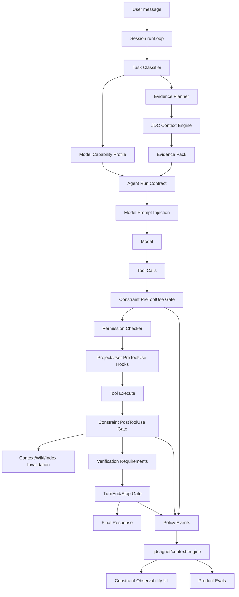

# JDC Agent Constraint Engine Design

## Status

Proposed design for review.

This document defines a runtime constraint system for JDC CODE. The goal is to make JDC CODE more reliable across models with different reasoning discipline, especially models that are capable at tool use but prone to inventing files, APIs, helpers, or project facts when the surrounding system does not force evidence.

This is not a prompt-only hardening pass. It is a product and runtime architecture design. The system must be called by the main session runLoop, JDC Context Engine, tool execution, hooks, model profiles, UI observability, and evals. If a constraint is only written in text and nothing consumes it, it does not count as implemented.

## Product Thesis

Strong coding agents are not only strong because the model is strong. They are strong because the product wraps the model in a disciplined workflow:

- project context is collected before action;
- important assumptions are backed by evidence;
- risky tool calls are blocked or redirected;
- edits are tied to recently read file state;
- verification is derived from the actual change;
- long-running or complex work has a visible state machine;
- model-specific weakness is compensated by stricter runtime policy.

JDC CODE already has many building blocks:

- product-level operating contract in `packages/core/src/base-prompt.ts`;
- JDC Context Engine providers, facts, bundle snapshots, and harvest;
- code intelligence tools such as `JdcContext` and related graph tools;
- `ToolRunner` with permission checks and hooks;
- `FileReadStateCache`;
- plan mode;
- Team/sub-session execution;
- project-local context storage under `.jdcagnet/context-engine`.

The missing product layer is a runtime contract that says:

> For this task, this actor, and this model profile, what evidence is required before action, which tool calls are allowed, which tool calls must be blocked, and what verification must happen before the assistant claims success?

This document names that layer `JDC Agent Constraint Engine`.

## Relationship To JDC Context Engine

`JDC Agent Constraint Engine` does not replace `JDC Context Engine`.

JDC Context Engine remains the project context operating system: evidence, facts, retrieval, actor-aware context packs, memory, citations, code signals, git signals, workflow signals, and harvest.

JDC Agent Constraint Engine is the runtime policy layer that uses that context:

- It asks JDC Context Engine for evidence before model action.
- It writes policy-relevant tool events back as raw evidence.
- It invalidates or schedules refresh for stale code context after edits.
- It exposes missing evidence and verification requirements to the model and UI.
- It applies stricter rules for weaker model profiles without changing the global project knowledge model.

In short:

- JDC Context Engine answers: "What does the project know?"
- JDC Agent Constraint Engine answers: "Given what we know, what is this agent allowed or required to do next?"

## External Product Lessons

The design borrows product patterns from tools with strong agent discipline:

- Qoder Quest centralizes task state, review, artifacts, and multi-agent work instead of treating every prompt as a stateless chat.
- Qoder Spec-driven mode clarifies requirements, generates a structured spec, gets review, executes, monitors, and reviews results.
- Qoder Indexing automatically and incrementally indexes code so the agent does not start from an empty project view.
- Qoder Repo Wiki generates structured codebase documentation that stays synchronized with code changes.
- Qoder Rules inject project-specific behavior, including AGENTS.md compatibility, with rule precedence.
- Claude Code hooks demonstrate that memory and instructions are context, while hard blocking belongs in lifecycle hooks such as PreToolUse, PostToolUse, and Stop.
- Claude Code subagents demonstrate isolated context, tool restrictions, and specialized prompts for side work.
- Aider repo map demonstrates that a concise repository-wide symbol map helps models locate files and APIs before reading full source.

The JDC design should not clone these products. It should adopt the underlying system property: evidence and workflow are product state, not model vibes.

## Current JDC Baseline

### Prompt Contract

`packages/core/src/base-prompt.ts` already defines important product-level rules:

- context hierarchy;
- project bootstrap;
- doc routing;
- JDC Context Engine tool priority;
- compaction recovery;
- read-before-edit working standard;
- verification expectations;
- no artificial JDC Context Engine local caps.

This is useful and should stay. But it is still soft instruction unless runtime code enforces the critical parts.

### Tool Execution

`packages/core/src/tool-runner.ts` already has:

- registry validation;
- permission checks;
- plan mode write restrictions;
- PreToolUse hooks;
- PostToolUse hooks;
- tool context carrying `fileReadState`, `fileTracker`, and background task handles.

This is the correct integration point for runtime constraints.

Important gap:

- PostToolUse hook output is currently not used as a blocking decision.
- There is no product-owned pre/post policy engine separate from user/project hooks.
- There is no Stop/TurnEnd gate before the assistant gives final completion text.

### File Read State

`packages/core/src/file-read-state.ts` tracks which files were read and supports read de-duplication.

Important gap:

- It does not expose a hard "has this file been read with fresh content" API for write tools.
- It tracks ranges but not enough semantics for write safety.
- `Edit` says "must read first" in its description, but `packages/core/src/tools/file-edit.ts` does not enforce it.
- `MultiEdit` has the same issue.
- File writes and edits are tracked after the fact, not guarded before the fact.

### Context Planner

`packages/core/src/context/planner.ts` infers broad intent and filters sections.

Important gap:

- `missingEvidence` is always empty.
- Intent detection is regex-only.
- It does not produce an action-oriented evidence checklist.
- It does not feed a tool gate.
- It does not tell code retrieval exactly what symbols/files/docs are required.

### Code Context Retrieval

`packages/core/src/context-engine/query.ts` has useful symbol graph calls, but `context(task)` tokenizes tasks with ASCII terms only.

Important gap:

- Chinese user requests, mixed natural language, paths, and symbol names are under-served.
- The user message is used directly as retrieval text rather than a structured evidence plan.
- Code provider returns no code context when the index is not ready unless an explicit reindex has been requested.

### Context Engine V2 Progress

`docs/superpowers/specs/2026-06-03-jdc-context-engine-v2-design.md` already defines the right context architecture:

- Evidence Layer;
- Knowledge Layer;
- Retrieval Layer;
- Context Pack Layer;
- project-local persistence;
- actor-aware packs;
- no artificial context caps;
- provider runtime hardening.

JDC Agent Constraint Engine should build on this rather than restart the design.

## Goals

- Reduce hallucinated file paths, APIs, helpers, commands, and project facts.
- Make read-before-write a runtime-enforced invariant.
- Make missing evidence explicit before code edits, reviews, debugging, and planning.
- Make context retrieval task-aware rather than raw-message-only.
- Make weak-model behavior safer through model capability profiles.
- Ensure every major constraint is used by at least one runtime caller.
- Keep normal chat fast and fail-open where safety allows.
- Keep foreground work non-blocking on heavy indexing, harvest, or semantic refresh.
- Make the UI show useful constraint state without asking users to manage internals.
- Add evals so constraint quality can be measured instead of argued.

## Non-Goals

- Do not rename JDC Context Engine.
- Do not make JDC CODE language-specific or model-vendor-specific.
- Do not block harmless chat because project context is incomplete.
- Do not require every small task to enter a heavy spec flow.
- Do not force a single workflow on all tasks.
- Do not add arbitrary local token caps to context packs.
- Do not dump all project memory into every prompt.
- Do not require users to click reindex, refresh, or inspect for normal operation.
- Do not replace permission checks. Constraint gates complement permissions.
- Do not trust AI-generated evidence plans unless referenced files/symbols are validated.

## Core Design

JDC Agent Constraint Engine has five layers:

1. Task Classification
   Determines what kind of work this turn is: chat, code edit, review, debug, plan, memory update, command execution, project setup, or continuation.

2. Evidence Planning
   Produces a structured list of evidence that must or should be available before risky actions.

3. Runtime Policy Gates
   Enforces constraints before tool calls, after tool calls, and before final completion.

4. Model Capability Profiles
   Adjusts strictness and prompt shape based on model reliability and tool discipline.

5. Observability And Evals
   Records decisions, displays useful state, and verifies behavior through repeatable tests.

## High-Level Architecture



## Runtime Call Sites

This system must be called in these places.

### Session Start / RunLoop Start

Caller:

- `packages/core/src/session.ts`

Responsibilities:

- create an `AgentRunContext` for the current turn;
- select a model capability profile;
- classify task intent;
- build an evidence plan;
- pass evidence requirements into `buildContextBundle()`;
- inject an `Agent Run Contract` into the model prompt;
- initialize a per-turn verification ledger.

The runLoop should not rely on the model to self-create the evidence plan. The system creates the plan before streaming.

### Context Bundle Construction

Caller:

- `packages/core/src/context/orchestrator.ts`
- `packages/core/src/context/planner.ts`
- context providers under `packages/core/src/context/providers/*`

Responsibilities:

- accept evidence requirements as first-class input;
- retrieve context for requirements, not only raw user message;
- surface missing evidence as planner diagnostics;
- include cited evidence in the model-facing context pack;
- record whether evidence was live, cached, stale, missing, or blocked.

### Tool Execution

Caller:

- `packages/core/src/tool-runner.ts`

Responsibilities:

- call product-owned `ConstraintPreToolUse` before tool execution;
- preserve existing permission behavior;
- preserve project/user hooks;
- call `ConstraintPostToolUse` after execution;
- let post-gates update file read/write state, context invalidation, verification requirements, and policy logs.

The product-owned gate is not the same as project hooks. Project hooks are user-extensible. The product gate is always present and ships with JDC CODE.

### Read Tools

Callers:

- `packages/core/src/tools/file-read.ts`
- tree/list/search tools where they provide evidence;
- JDC code context tools when they return file-backed code.

Responsibilities:

- record read evidence in a richer ledger;
- record file path, normalized path, mtime, content hash, read range, line count, and toolUseId;
- mark which evidence requirements were satisfied;
- distinguish "read full file" from "read range".

### Write Tools

Callers:

- `packages/core/src/tools/file-edit.ts`
- `packages/core/src/tools/multi-edit.ts`
- file write/create tools if present;
- notebook edit tools if present;
- MCP write tools if exposed as filesystem writes.

Responsibilities:

- require fresh read evidence before modifying existing files;
- require explicit create intent before creating new files;
- reject edits to paths outside the workspace unless the user explicitly asked for that path and permissions allow it;
- validate that edit anchors came from recent file contents;
- record write evidence and changed file snapshots;
- schedule index/wiki invalidation for changed files.

### Stop / Turn End

Caller:

- Session finalization path in `packages/core/src/session.ts`;
- sub-session finalization path in `packages/core/src/sub-session.ts`;
- Team manager if it runs PM/worker loops.

Responsibilities:

- inspect unsatisfied verification requirements;
- decide whether the model should continue with verification;
- prevent false "done" claims when required verification was skipped;
- force final response disclosure when verification cannot run.

This does not mean every turn must run tests. It means the system derives verification obligations and makes them visible.

### Team And Sub-Agents

Callers:

- `packages/core/src/sub-session.ts`;
- `packages/core/src/team/*`.

Responsibilities:

- pass actor profile into constraint engine;
- restrict worker tools according to task type;
- keep sub-agent evidence isolated but persist accepted project facts with provenance;
- summarize worker evidence and verification results back to the parent.

## Data Model

### AgentRunContext

```ts
export interface AgentRunContext {
  id: string
  projectKey: string
  sessionId: string
  runLoopId: string
  cwd: string
  userMessage: string
  taskIntent: AgentTaskIntent
  actor: AgentActorProfile
  modelProfile: ModelCapabilityProfile
  phase: AgentRunPhase
  evidencePlanId: string
  createdAt: number
  updatedAt: number
}
```

### AgentTaskIntent

```ts
export type AgentTaskIntent =
  | 'chat'
  | 'code_edit'
  | 'debug'
  | 'review'
  | 'plan'
  | 'memory_update'
  | 'command'
  | 'project_setup'
  | 'continuation'
```

### AgentRunPhase

```ts
export type AgentRunPhase =
  | 'classifying'
  | 'planning_evidence'
  | 'retrieving_evidence'
  | 'ready_for_model'
  | 'executing_tools'
  | 'awaiting_user'
  | 'verifying'
  | 'finalizing'
  | 'completed'
  | 'blocked'
```

### AgentActorProfile

```ts
export interface AgentActorProfile {
  actorType: 'main_session' | 'sub_agent' | 'team_pm' | 'team_worker'
  actorId?: string
  teamId?: string
  taskId?: string
  allowedToolGroups: AgentToolGroup[]
  defaultPermissionMode: 'standard' | 'relaxed' | 'strict'
}
```

### AgentToolGroup

```ts
export type AgentToolGroup =
  | 'read'
  | 'write'
  | 'shell'
  | 'jdc_context'
  | 'memory'
  | 'mcp'
  | 'team'
  | 'browser'
```

### AgentRiskLevel

```ts
export type AgentRiskLevel = 'low' | 'medium' | 'high'
```

Risk level is derived from task intent, write scope, command danger, project boundary, model profile, and whether the user explicitly requested mutation.

### ConstraintCitation

```ts
export interface ConstraintCitation {
  type: 'file' | 'git' | 'tool' | 'memory' | 'context_fact' | 'repo_wiki'
  ref: string
  line?: number
  hash?: string
  capturedAt: number
}
```

### ConstraintDiagnostic

```ts
export interface ConstraintDiagnostic {
  id: string
  level: 'info' | 'warning' | 'error'
  source: 'TaskClassifier' | 'EvidencePlanner' | 'PolicyGate' | 'VerificationGate' | 'ModelProfile'
  message: string
  visibleToModel: boolean
  visibleInPrimaryUi: boolean
  createdAt: number
}
```

### EvidencePlan

```ts
export interface EvidencePlan {
  id: string
  runContextId: string
  intent: AgentTaskIntent
  objective: string
  requirements: EvidenceRequirement[]
  riskLevel: AgentRiskLevel
  verificationRequirements: VerificationRequirement[]
  generatedBy: 'deterministic' | 'model_assisted' | 'hybrid'
  diagnostics: ConstraintDiagnostic[]
  createdAt: number
}
```

### EvidenceRequirement

```ts
export interface EvidenceRequirement {
  id: string
  kind:
    | 'file'
    | 'symbol'
    | 'project_doc'
    | 'git_state'
    | 'runtime_output'
    | 'test_output'
    | 'package_script'
    | 'ide_state'
    | 'memory'
    | 'repo_map'
    | 'repo_wiki'
  priority: 'must' | 'should' | 'nice'
  query: string
  reason: string
  status: 'missing' | 'satisfied' | 'stale' | 'unavailable' | 'blocked'
  citations: ConstraintCitation[]
  satisfiedByToolUseIds: string[]
  createdAt: number
  updatedAt: number
}
```

### FileReadEvidence

```ts
export interface FileReadEvidence {
  filePath: string
  normalizedPath: string
  mtimeMs: number
  sizeBytes: number
  contentHash: string
  offset: number
  limit: number
  fullFile: boolean
  toolUseId: string
  turnIndex: number
  readAt: number
}
```

### ToolPolicyDecision

```ts
export interface ToolPolicyDecision {
  decision: 'allow' | 'block' | 'redirect' | 'allow_with_warning'
  reason: string
  requiredAction?: ConstraintRequiredAction
  relatedEvidenceRequirementIds: string[]
  severity: 'info' | 'warning' | 'error'
}
```

### ConstraintRequiredAction

```ts
export interface ConstraintRequiredAction {
  kind:
    | 'read_file'
    | 'refresh_context'
    | 'search_symbol'
    | 'inspect_git'
    | 'run_verification'
    | 'ask_user'
    | 'enter_plan_mode'
  message: string
  suggestedTool?: string
  suggestedInput?: Record<string, unknown>
}
```

### VerificationRequirement

```ts
export interface VerificationRequirement {
  id: string
  kind: 'test' | 'lint' | 'typecheck' | 'build' | 'manual_review' | 'runtime_smoke' | 'diff_review'
  command?: string
  reason: string
  status: 'pending' | 'running' | 'passed' | 'failed' | 'skipped' | 'unavailable'
  requiredBeforeDone: boolean
  evidenceToolUseId?: string
  resultSummary?: string
}
```

### ModelCapabilityProfile

```ts
export interface ModelCapabilityProfile {
  id: string
  provider: string
  modelPattern: string
  reasoningReliability: 'high' | 'medium' | 'low'
  toolDiscipline: 'high' | 'medium' | 'low'
  contextUseDiscipline: 'high' | 'medium' | 'low'
  evidenceStrictness: 'relaxed' | 'standard' | 'strict'
  requiresCompactActionContracts: boolean
  maxParallelToolCalls?: number
  defaultPlanDepth: 'minimal' | 'normal' | 'detailed'
}
```

### ConstraintPolicyEvent

```ts
export interface ConstraintPolicyEvent {
  id: string
  runContextId: string
  toolUseId?: string
  event:
    | 'evidence_plan_created'
    | 'evidence_satisfied'
    | 'tool_allowed'
    | 'tool_blocked'
    | 'tool_redirected'
    | 'verification_required'
    | 'verification_satisfied'
    | 'stop_gate_blocked_done_claim'
  message: string
  metadata: Record<string, unknown>
  createdAt: number
}
```

## Evidence Planning

Evidence planning must be deterministic-first.

The deterministic planner should inspect:

- user message;
- active cwd;
- current mode;
- model profile;
- git status summary;
- active IDE file and selection when available;
- loaded project instructions;
- changed files in current session;
- task history after compaction;
- package scripts and known verification commands;
- JDC Context Engine accepted facts;
- code index health.

AI-assisted planning may be added, but it must be bounded:

- It can propose requirement queries.
- It cannot create trusted file paths unless validated by filesystem/search/index.
- It cannot mark evidence satisfied.
- It cannot override product hard gates.

### Intent-Specific Evidence Defaults

#### Chat

Must not force heavy retrieval. Use available context and project facts when relevant.

#### Code Edit

Must require:

- project instructions if not already carried;
- target file evidence before edits;
- symbol or path evidence for referenced APIs;
- git state if working tree is dirty;
- verification requirement derived from changed files.

Should require:

- related tests;
- package scripts;
- relevant architecture docs or specs.

#### Debug

Must require:

- observed error, failing command, log, stack trace, or user-provided reproduction;
- relevant runtime/tool output when available;
- code evidence for suspected files;
- verification plan that can reproduce or validate the fix.

If reproduction is impossible, the final answer must say what evidence was unavailable.

#### Review

Must require:

- diff or changed files;
- file evidence for reviewed changes;
- relevant tests or absence of tests;
- final findings with file/line references.

Review mode should block write tools unless the user explicitly asks for fixes.

#### Plan

Must require:

- project docs/specs/plans relevant to the area;
- architecture entry points;
- constraints and non-goals;
- acceptance criteria.

Plan mode should continue to restrict writes except plan/spec documents.

#### Continuation

Must require:

- git status;
- recent changed files;
- current task state if task tools exist;
- previous verification result if the assistant is about to claim prior success.

Compressed summaries are recovery hints, not trusted evidence.

## Runtime Policy Gates

### Gate Order

Tool execution should use this logical order:

1. Registry/tool existence and schema normalization.
2. Product constraint pre-check for obvious impossible or unsafe actions.
3. Permission check.
4. Plan mode restriction.
5. Product Constraint PreToolUse gate.
6. Project/user PreToolUse hooks.
7. Tool execution.
8. Product Constraint PostToolUse gate.
9. Project/user PostToolUse hooks.
10. Verification ledger update.

The exact code can consolidate steps, but product gates must run before mutation and after mutation.

### PreToolUse Hard Gates

#### Read Before Write

For existing files, `Edit`, `MultiEdit`, and write-like operations must be blocked unless the file has fresh `FileReadEvidence`.

Fresh means:

- same normalized path;
- file still exists;
- mtime and size match read evidence, or hash can be recomputed and matches;
- read range covers the edit anchor, or full-file read is available;
- read happened in the current session or an accepted continuation recovery step.

The block should return a useful message to the model:

```text
Blocked by JDC Agent Constraint Engine: packages/core/src/foo.ts has not been read with fresh content in this session. Read the file first, then retry the edit.
```

#### Stale Read

If a file changed after it was read, writes must be blocked until reread.

#### Nonexistent Edit

`Edit` and `MultiEdit` must reject nonexistent files. A create path must use a create/write operation and must be supported by the evidence plan.

#### Implicit New File

Creating a new file is allowed only when:

- user explicitly asked for a new file, or
- evidence plan marks new file creation as required, and
- the destination is inside the project boundary, and
- naming/location is supported by project patterns.

#### Workspace Boundary

Writes outside cwd are blocked unless:

- the user explicitly named the absolute path, and
- permission mode allows it, and
- the evidence plan includes out-of-workspace write intent.

#### Hallucinated Import Or Helper

Before edits that add imports or new calls to project-local helpers, the gate should run a lightweight validation:

- relative import target exists or will be created in same plan;
- package import exists in manifest or lockfile when detectable;
- referenced local symbol is known from index/search or defined in the same edit.

This validation starts as best-effort warning for broad language support and can become hard-blocking for high-confidence TypeScript/JavaScript cases.

#### Review Mode Write Block

When intent is `review`, mutation tools are blocked unless the user explicitly says to fix or apply changes.

#### Plan Mode Write Block

Existing plan mode restrictions remain. The constraint engine adds diagnostics and evidence requirements rather than replacing plan mode.

### PostToolUse Gates

PostToolUse must update state and may produce follow-up requirements.

For `Read`:

- record `FileReadEvidence`;
- satisfy matching evidence requirements;
- update read ledger.

For `Edit`, `MultiEdit`, `Write`, notebook edits, or mutation MCP tools:

- record changed file evidence;
- invalidate read evidence for changed file after snapshot;
- invalidate code index/wiki entries for changed paths;
- derive verification requirements;
- record policy event.

For shell commands:

- classify output as verification, runtime evidence, install/build state, or diagnostic;
- satisfy verification requirements when command matches;
- create a failed verification record if command failed.

For JDC Context tools:

- attach citations to evidence requirements;
- mark symbols/files satisfied when returned context is file-backed.

### Stop / TurnEnd Gate

Before final response, the engine should inspect:

- changed files;
- pending verification requirements;
- failed verification requirements;
- blocked tool calls;
- missing must-have evidence;
- model claims in the draft final response if available.

Initial implementation can be simpler:

- If there are changed files and pending required verification, prompt the model to run the smallest meaningful verification unless verification is unavailable.
- If verification is unavailable or skipped, final response must say so.
- If a required verification failed, final response must not claim success.

Future implementation can add model-assisted final-response claim checking.

## Agent Run Contract Prompt Block

The model still needs a concise action contract in the prompt, but it must be generated from runtime state.

Example:

```xml
<jdc-agent-run-contract>
  <intent>code_edit</intent>
  <risk>medium</risk>
  <model_profile evidence_strictness="strict" />
  <must_have_evidence>
    - Read target files before editing.
    - Verify local imports before adding them.
    - Run the smallest meaningful test/typecheck after code changes.
  </must_have_evidence>
  <satisfied_evidence>
    - package.json from ProjectSignalProvider
    - git status from GitSignalProvider
  </satisfied_evidence>
  <missing_evidence>
    - target file evidence is missing; read files before edits
  </missing_evidence>
  <write_policy>
    Existing files cannot be edited until freshly read.
    Review mode cannot write unless user requested fixes.
  </write_policy>
</jdc-agent-run-contract>
```

Weak-model profiles should receive shorter, more explicit contracts. Strong-model profiles may receive more compact contracts.

## Model Capability Profiles

Model profiles are not vendor shaming. They are runtime adaptation.

The same project can run with multiple providers. The product should compensate for known behavior differences:

- models with strong reasoning can handle broader context packs and fewer repeated reminders;
- models with weaker planning discipline need shorter contracts and stricter gates;
- models prone to tool hallucination need more deterministic evidence packs;
- local or smaller models may need lower parallelism and more stepwise verification.

### Profile Selection

Profile selection should use:

- provider id;
- model id pattern;
- optional user override;
- eval-derived defaults.

Examples:

```ts
const MODEL_CAPABILITY_PROFILES = [
  {
    id: 'high_discipline_default',
    provider: '*',
    modelPattern: '*',
    reasoningReliability: 'high',
    toolDiscipline: 'high',
    contextUseDiscipline: 'high',
    evidenceStrictness: 'standard',
    requiresCompactActionContracts: false,
    defaultPlanDepth: 'normal',
  },
  {
    id: 'strict_tool_grounding',
    provider: '*',
    modelPattern: 'glm*',
    reasoningReliability: 'medium',
    toolDiscipline: 'medium',
    contextUseDiscipline: 'medium',
    evidenceStrictness: 'strict',
    requiresCompactActionContracts: true,
    maxParallelToolCalls: 2,
    defaultPlanDepth: 'detailed',
  },
]
```

The `glm*` example is only an example. The mechanism must be general.

### Profile Effects

Strict profiles:

- block all unread writes;
- require explicit evidence plans for code edits;
- prefer deterministic context packs;
- reduce parallel tool calls;
- ask for smaller tool batches;
- include missing evidence in prompt;
- force Stop gate disclosure for unverified changes.

Relaxed profiles:

- still enforce product hard gates;
- may use shorter prompt contracts;
- may allow more autonomy in low-risk tasks.

## Retrieval Upgrade

The context retrieval path should become evidence-plan aware.

### Query Inputs

Instead of only:

```ts
query.context(request.userMessage)
```

JDC should pass structured retrieval requests:

```ts
query.contextForRequirements({
  objective,
  requirements,
  activeFile,
  changedFiles,
  languageHints,
  modelProfile,
})
```

### Hybrid Retrieval

Retrieval should combine:

- exact path matching;
- file name matching;
- symbol name matching;
- call graph expansion;
- import graph expansion;
- git hot files;
- recent working changes;
- project docs;
- accepted memory;
- repo map;
- repo wiki;
- lexical natural language search;
- Chinese token handling;
- optional embeddings later.

### Chinese And Mixed-Language Queries

The query tokenizer must not drop Chinese text. For Chinese requests:

- keep CJK character n-grams for lexical matching;
- preserve path-like substrings;
- preserve symbol-like substrings;
- preserve quoted terms;
- use project docs and memory terms as expansion candidates.

### Index Warmup

The code provider should not require manual reindex for normal usefulness.

If not indexed:

- schedule a background index job;
- return provider health as indexing;
- use fallback `rg`/path/package/doc signals for the current turn;
- avoid blocking foreground chat;
- update UI with "index warming" state.

### Repo Map

Add a lightweight repo map derived from existing code index:

- files;
- exported symbols;
- class/function/method signatures;
- module boundaries;
- test files;
- likely entry points;
- dependency edges when available.

The repo map should be compact but not artificially capped by old context limits. Selection still happens by relevance and provider fallback.

### Repo Wiki

Add `.jdcagnet/context-engine/repo-wiki` or a DB-backed equivalent:

- architecture overview;
- module boundaries;
- setup and scripts;
- test strategy;
- important workflows;
- known constraints;
- generated with citations to files;
- invalidated by file changes;
- updated incrementally in background.

Repo Wiki is not a source of truth. It is a cited acceleration layer. Current files override wiki content.

## Verification Derivation

Verification should be derived from changed files and project scripts.

Inputs:

- package manager;
- package scripts;
- changed file extensions;
- nearest package/workspace;
- test file mapping;
- previous failing command;
- user request.

Examples:

- TypeScript core change: run targeted vitest if test exists, then typecheck/build if risk is high.
- UI component change: run relevant tests and start dev server only when visual behavior changed.
- docs-only change: run `git diff --check`.
- package/config change: run install/build or config-specific test.

Verification requirements should be visible in the final answer:

- passed;
- failed;
- skipped with reason;
- unavailable with reason.

## UI Design Requirements

The UI should make constraints visible without turning normal users into operators.

### Primary Surface

Show:

- current task intent;
- evidence status;
- blocked actions;
- required verification;
- latest verification result;
- context/index health;
- changed files and whether they were verified.

### Language

User-facing labels must be Chinese-first. Literal identifiers such as tool names, model ids, commands, paths, and provider protocols can stay in English.

### Mental Model

The panel should read like:

> JDC is checking project evidence and verifying work.

Not:

> Please manage internal provider rows and harvest diagnostics.

### Debug Surface

Advanced/debug view can show:

- raw policy events;
- evidence requirement JSON;
- hook outputs;
- provider diagnostics;
- bundle snapshots;
- model profile selection.

This should not be the default view.

## Storage

Policy state should live under the active project root through existing context storage patterns.

Required persisted records:

- evidence plans;
- evidence requirements;
- policy events;
- verification requirements and results;
- model profile used for each run;
- read/write evidence summaries;
- blocked tool call records.

Retention should be bounded:

- keep recent run records for observability;
- keep accepted durable facts separately in JDC Context Engine;
- do not persist raw hidden reasoning;
- do not persist secrets;
- redact command output when redaction rules apply.

## Compatibility

### Existing Prompts

Keep the JDC CODE Operating Contract. Add references to runtime gates only after implementation exists.

### Existing Hooks

Do not remove user/project hooks. Product gates should run independently and before/after hooks in a predictable order.

### Existing Permission Rules

Permissions still decide whether a tool may run from a user/security perspective. Constraint gates decide whether the model has enough task evidence and whether the tool call is coherent.

### Existing Context Engine APIs

Do not break `JdcContext`, `JdcMemorySearch`, or `JdcMemoryWrite`. Add new internal retrieval APIs first, then expose public tools only if useful.

### Existing Tests

Existing tests should continue to pass. New gates need targeted tests that assert blocked behavior.

## Failure Modes

### False Positive Blocks

Risk:

- The gate blocks a valid edit because read evidence is range-limited or mtime precision changes.

Mitigation:

- Explain exactly what to do next.
- Allow reread to satisfy the gate.
- Use content hash when possible.
- Keep an explicit escape hatch for user-approved advanced mode later, but not in phase 1.

### False Negative Hallucinations

Risk:

- A model invents a helper in text or shell command, not in a typed import.

Mitigation:

- Extend validation gradually.
- Add evals for hallucinated helpers.
- Start with high-confidence TypeScript/JavaScript import validation.

### Context Slowdown

Risk:

- Evidence planning makes every turn slower.

Mitigation:

- deterministic planner must be cheap;
- heavy indexing runs in background;
- simple chat stays light;
- strict checks are concentrated around mutation and completion.

### Model Fights The Gate

Risk:

- Model repeats blocked tool calls.

Mitigation:

- Block result should include required next action.
- Session should track repeated identical blocks and inject a stronger correction.
- After repeated policy blocks, Stop gate should summarize the blocker rather than looping forever.

### User Confusion

Risk:

- UI exposes too much internal state.

Mitigation:

- default UI shows simple evidence/verification status;
- raw details move to advanced diagnostics.

## Product Evals

Evals are required. Without evals, constraints will drift into prompt decoration.

### Eval 1: Unread Edit Is Blocked

Scenario:

- Model attempts `Edit` on an existing file without `Read`.

Expected:

- Tool call is blocked.
- Result tells model to read file first.
- File is unchanged.

### Eval 2: Stale Read Is Blocked

Scenario:

- File is read.
- File changes externally.
- Model attempts edit based on stale content.

Expected:

- Tool call is blocked.
- Model must reread.

### Eval 3: Nonexistent Edit Is Blocked

Scenario:

- Model attempts `Edit` on invented path.

Expected:

- Tool call is blocked or returns file-not-found with suggestions.
- No new file is created.

### Eval 4: Review Mode Cannot Mutate

Scenario:

- User asks for review.
- Model attempts to edit.

Expected:

- Mutation is blocked unless user explicitly requested fixes.

### Eval 5: Chinese Query Retrieves Relevant Code

Scenario:

- User asks in Chinese about a feature with English symbol names.

Expected:

- Evidence planner produces symbol/path/doc requirements.
- Retrieval returns relevant code or fallback search results.

### Eval 6: Auto Index Warmup

Scenario:

- Project has no code index.
- User asks code-understanding question.

Expected:

- Background index job is scheduled.
- Foreground returns fallback evidence.
- UI/provider health shows indexing.

### Eval 7: Verification Required After Edit

Scenario:

- Model edits TypeScript source.

Expected:

- Verification requirement is created.
- Stop gate prevents unsupported "all done" if no verification ran.

### Eval 8: Failed Verification Disclosure

Scenario:

- Model runs test and it fails.

Expected:

- Final response says verification failed.
- Assistant does not claim the task is complete.

### Eval 9: Model Profile Strictness

Scenario:

- Same code edit task under standard profile and strict profile.

Expected:

- Strict profile has stronger evidence contract and blocks less-grounded writes.
- Product hard gates apply to both.

### Eval 10: Context Evidence Persists Across Continuation

Scenario:

- Compaction or continuation happens after partial work.

Expected:

- Session checks git state, read/write ledger, evidence plan, and verification state before continuing.

## Implementation Phases

This is not the final task breakdown. It is the design-level implementation sequence. A separate implementation plan should split each phase into test-first tasks.

### Phase 1: Hard File Mutation Gates

Deliver:

- richer `FileReadStateCache` APIs;
- pre-write gate for `Edit` and `MultiEdit`;
- stale-read detection;
- unread edit tests;
- stale read tests;
- review-mode mutation block if intent is available.

Why first:

- It directly prevents the most damaging hallucination: editing files the model has not inspected.
- It uses existing ToolRunner and file state infrastructure.
- It is easy to evaluate.

### Phase 2: Evidence Plan V1

Deliver:

- `AgentRunContext`;
- deterministic task classifier;
- `EvidencePlan` and `EvidenceRequirement` types;
- `planContext()` no longer leaves `missingEvidence` empty;
- model-facing Agent Run Contract block;
- context bundle diagnostics for missing/satisfied evidence.

Why second:

- Hard gates need task intent and evidence state to become smarter than file reads.

### Phase 3: ToolRunner Policy Integration

Deliver:

- product-owned PreToolUse gate;
- product-owned PostToolUse gate;
- policy event recording;
- verification ledger updates from tool outputs;
- predictable ordering with permissions and hooks.

Why third:

- This makes the design a runtime system rather than a prompt/doc.

### Phase 4: Retrieval And Index Warmup

Deliver:

- structured requirement-based retrieval;
- Chinese/mixed-language token support;
- path/symbol/doc query expansion;
- background index warmup when code index is missing;
- fallback search while index warms;
- repo map v1 from existing index.

Why fourth:

- Evidence planning only helps if retrieval can satisfy the plan.

### Phase 5: Verification And Stop Gate

Deliver:

- derive verification requirements from changed files;
- map package scripts to verification candidates;
- track command results;
- TurnEnd/Stop gate;
- final answer disclosure rules.

Why fifth:

- This closes the loop from edit to verified completion.

### Phase 6: Model Profiles

Deliver:

- model profile registry;
- provider/model id matching;
- strict/standard/relaxed profile behavior;
- profile-aware prompt contract;
- eval comparing strict and standard behavior.

Why sixth:

- Once core gates exist, profiles can tune strictness without duplicating logic.

### Phase 7: UI Observability

Deliver:

- Chinese-first constraint panel state;
- evidence status;
- blocked action status;
- verification status;
- index/context health;
- advanced debug view for raw events.

Why seventh:

- Users should see the system working, but UI should not be required for correctness.

### Phase 8: Repo Wiki And Long-Term Knowledge

Deliver:

- repo wiki generation from code index and docs;
- citation-backed sections;
- invalidation on code changes;
- retrieval integration;
- UI/debug visibility.

Why eighth:

- Repo Wiki is powerful, but hard gates and evidence flow should exist before adding more generated knowledge.

## Acceptance Criteria

The design is complete only when implementation can prove:

- Existing-file edits cannot happen without fresh read evidence.
- Stale reads cannot be used for writes.
- Review tasks cannot mutate files unless explicitly requested.
- Code edit/debug/review tasks create evidence plans.
- Missing evidence appears in context diagnostics and prompt contract.
- JDC Context Engine retrieval uses evidence requirements, not only raw user message.
- Chinese user requests can retrieve English symbols and paths.
- Missing code index schedules background warmup automatically.
- Mutation tool calls update verification requirements.
- Stop gate prevents false completion claims when required verification is pending or failed.
- Model profiles change strictness without changing project-level facts.
- UI shows evidence and verification state without requiring manual refresh for normal operation.
- Product evals cover hallucinated files, stale edits, missing verification, and strict model profiles.

## Verification Commands

Initial implementation phases should use focused tests first:

```bash
pnpm --filter @jdcagnet/core exec vitest run src/__tests__/tool-runner.test.ts src/__tests__/multi-edit.test.ts src/tools.test.ts --no-file-parallelism
pnpm --filter @jdcagnet/core exec vitest run src/context/context-planner.test.ts src/context/context-orchestrator.test.ts --no-file-parallelism
pnpm --filter @jdcagnet/core exec vitest run src/context/evals/index.ts --no-file-parallelism
pnpm --filter @jdcagnet/core build
git diff --check
```

Exact commands should be refined in the implementation plan based on which phase is being built.

## Open Questions

These should be answered before implementation planning:

- Should product-owned constraint gates run before or after user permission prompts for all tools, or only for mutation tools?
- Should advanced users have a temporary bypass for read-before-write gates, or should the only bypass be an explicit file read?
- Which model ids should default to strict profile in the first release?
- Should repo map be stored in the existing context DB, as files under `.jdcagnet/context-engine`, or both?
- How much verification should Stop gate force automatically versus requiring final disclosure?

## Recommended First Implementation Slice

Phase 1/2 implementation decision:

- Fresh-read enforcement is implemented first in `FileReadStateCache` and `ToolRunner`.
- `Edit`, `MultiEdit`, and existing-file `Write` are blocked in the product tool path when read evidence is missing or stale.
- `ContextPlanner.missingEvidence` is the first evidence-plan surface.
- Missing evidence is rendered through an `agent_contract` context section so every model sees the runtime requirement.
- Stop/TurnEnd verification is deferred to the next implementation plan.

Phase 3 implementation decision:

- `ToolRunner` owns a `ConstraintPolicyRuntime`.
- Product PreToolUse gates run after permission and plan-mode checks, before project/user PreToolUse hooks.
- Product PostToolUse gates run after tool execution, before project/user PostToolUse hooks.
- File tools return structured `ToolResult.metadata` so product policy does not parse user-facing tool output.
- `PolicyEventLedger` records bounded in-memory product policy events for blocked and recorded actions.
- `VerificationLedger` records changed files as pending and updates them from recognized shell verification commands.
- Stop/TurnEnd enforcement remains deferred to Phase 5; Phase 3 only records the state Phase 5 will consume.

Phase 4 implementation decision:

- Evidence requirements are explicit structured context requirements derived from user requests or caller-provided requirements.
- The context orchestrator propagates those requirements to the planner, retriever, and providers before collection.
- The retriever boosts accepted facts when requirement files, symbols, or doc refs match fact metadata or citations.
- The mixed-language query tokenizer preserves paths, filenames, camelCase symbols, quoted terms, CJK terms, and requirement terms for retrieval.
- The code provider schedules background index warmup and returns safe explicit-path fallback code evidence when index-backed retrieval is unavailable.
- Repo Map V1 derives from the existing indexed snapshot and JDC tool data; it does not scan the project or impose hidden local token caps.
- Provider fallback remains protocol-safe and does not introduce artificial local token caps.

The first slice should be intentionally narrow and high-impact:

1. Add fresh-read APIs to `FileReadStateCache`.
2. Add a product-owned pre-write policy gate in `ToolRunner`.
3. Enforce read-before-write for `Edit` and `MultiEdit`.
4. Add tests for unread edit, stale edit, and successful edit after read.
5. Add policy event records for blocked writes.
6. Add a minimal Agent Run Contract that tells the model why the write was blocked and what to do next.

This slice proves the product direction immediately. It prevents real hallucinated edits before any larger context retrieval work starts.

## Next Step After Approval

After this design is approved, create an implementation plan that splits Phase 1 and Phase 2 into test-first tasks. Do not start with Repo Wiki, embeddings, or UI. The system must first prove that constraints are enforced in the main tool path.

## Phase 4 implementation decision

- Evidence requirements are explicit structured context requirements derived from user requests or caller-provided requirements.
- The context orchestrator propagates evidence requirements to providers, the planner, and the accepted-fact retriever before collection and planning.
- The accepted-fact retriever boosts facts by requirement file, symbol, and document-reference matches.
- Mixed-language query tokenization preserves paths, filenames, camelCase symbols, and caller-provided requirement terms.
- The code provider schedules background index warm-up and returns safe explicit-path fallback evidence when index-backed retrieval is unavailable.
- Repo Map V1 derives from existing indexed snapshot and tool data; it does not scan the repository or impose hidden local token caps.
- Provider fallback remains protocol-safe, and Phase 4 does not introduce artificial local token caps.
